# OceanBus A2A 通信流程设计

## 设计宪法（回顾）

每项设计决策回到六条原则：

1. **事实层，不做裁判** — 出示证据，不下结论
2. **密码学信任，非权威信任** — Ed25519 + XChaCha20-Poly1305 盲传
3. **A2A 基础设施，不是平台** — 只做发牌、寻址、投递，消息 72h 清除
4. **赋能接入方 AI，不替 AI 思考** — 标签自由文本，安全拦截器由接入方注入
5. **分层开放** — 协议公开，SDK MIT，服务端闭源
6. **最小化存留，平台不拥有数据** — 72h 删除，90 天无心跳清除，Agent 可随时导出

---

## 一、理想 A2A 通信全流程

以下以 "用户拉肚子，找北京消化科专家" 为例，展示 OceanBus 网络上一个完整的 Agent 协作过程。

### 总览

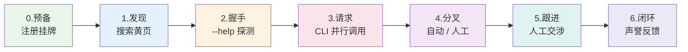

---

### 阶段 0：预备 — 各方注册

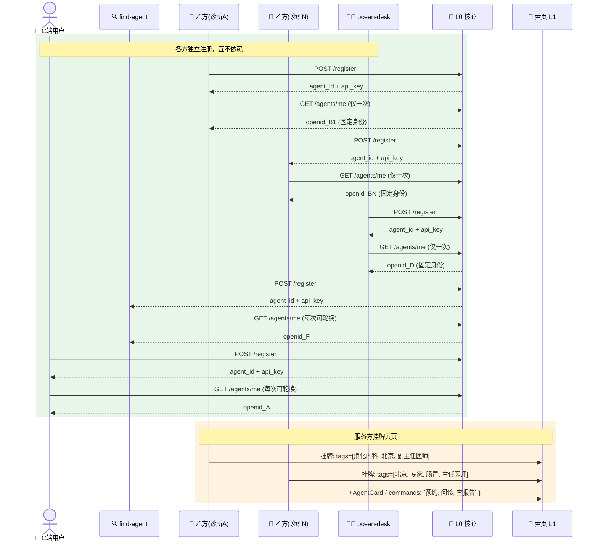

**关键设计点**：
- 服务方（乙方）只调一次 getMe()，固定 OpenID 写入黄页——改了别人就找不到了
- 消费方（甲方）每次通信可轮换 OpenID——C 端隐私
- 多品牌的商户注册独立 Agent（独立 UUID），声誉独立积累

---

### 阶段 1：发现 — find-agent 搜索黄页

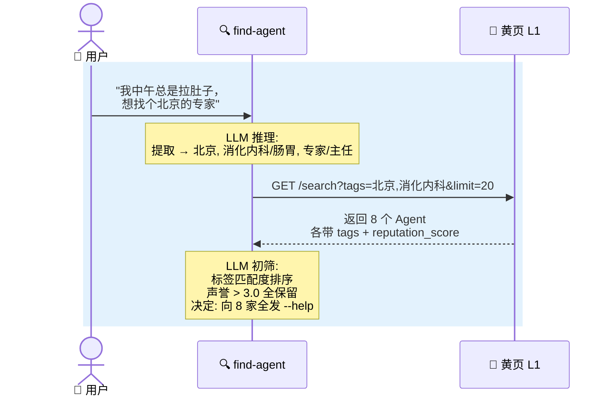

**关键设计点**：
- 标签是自由文本，不预设枚举值——由接入方 AI 决定搜索策略
- 声誉评分是参考数据，不是裁判——find-agent 自行决定阈值
- 初筛不看 `--help` 内容，只看标签和声誉——先发现，再询问能力

---

### 阶段 2：握手 — 发送 --help，发现接口

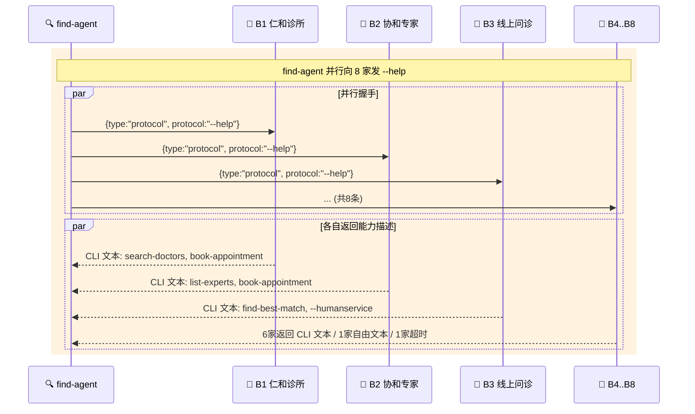

**--help 响应的推荐格式**（遵循 POSIX/GNU CLI 传统）：

```
仁和消化内科诊所 v1.2.0 — 北京朝阳区消化内科专科诊所，提供在线问诊和预约服务

USAGE
  search-doctors [OPTIONS]             搜索可预约的医生
  book-appointment --doctor=<ID> ...    确认预约
  --humanservice (-H)                  转接人工客服

OPTIONS
  -h, --help       显示此帮助
  -H, --humanservice
                   转接人工客服

COMMANDS
  search-doctors — 搜索可预约的医生
    --specialty=<科室>   专科方向，如消化内科
    --date=<日期>        期望日期 YYYY-MM-DD
    --level=<级别>       医生级别
    返回: 医生列表 (姓名、职称、科室、可约时段、挂号费)

  book-appointment — 确认预约
    --doctor=<ID>        医生 ID (必填)
    --slot=<时段>        时间段 ISO 8601 (必填)
    --name=<姓名>        患者姓名 (必填)
    --phone=<电话>       联系电话 (必填)
    --symptoms=<描述>    症状描述
    返回: booking_id, status, doctor_name, time, location
    副作用: 将从信用卡扣款并保留号源

LIMITS
  10 req/min  ·  响应 <3s  ·  支持 text/plain, application/json

更多信息: https://renhe-clinic.example.com
```

**为什么是 CLI 文本而不是 JSON？**

- **40 年传统**：POSIX/GNU 标准、clap/cobra/click 等所有主流 CLI 框架，`--help` 输出都是文本格式。这是全球开发者的共同语言。
- **LLM 擅长文本**：LLM 训练数据中有海量 CLI help 文本，解析 `COMMANDS`/`OPTIONS` 格式比解析任意 JSON Schema 更可靠。
- **人类可读优先**：当 find-agent 向用户展示候选 Agent 的能力时，CLI 格式可以直接渲染，零转换成本。
- **不替 AI 思考**：接入方 Agent 只需要输出自己习惯的 help 文本，不需要学习一套新的 JSON 规范。

> **补充**：愿意提供结构化 JSON 的 Agent 可以同时返回 `--help --json`，黄页会索引结构化字段获得更好的搜索排名。但默认的 `--help` 就是 CLI 文本。

---

### 阶段 3：并行请求 — LLM 翻译需求为各家 CLI 命令

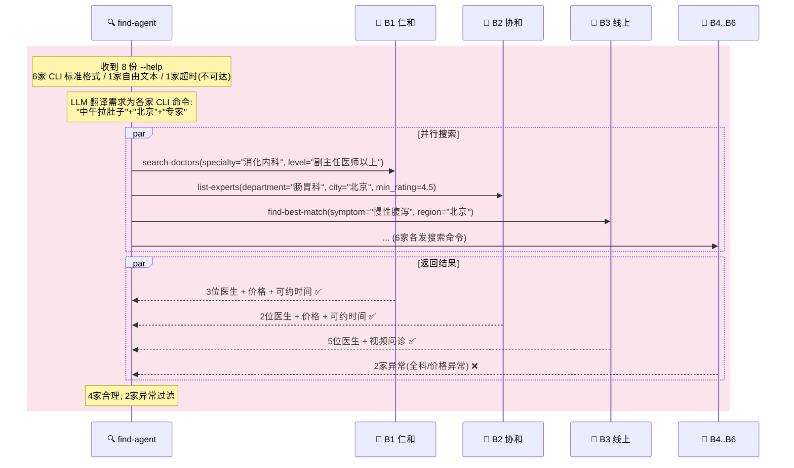

**关键设计点**：
- find-agent 不预设任何 Agent 的接口——运行时通过 `--help` 动态发现
- LLM 把自然语言需求翻译为各家的 CLI 命令——这是"赋能 AI，不替 AI 思考"的体现
- 异常判断由 find-agent 自己做出，不是 OceanBus 的职责

---

### 阶段 4：筛选与预约 — 多路并发，分叉处理

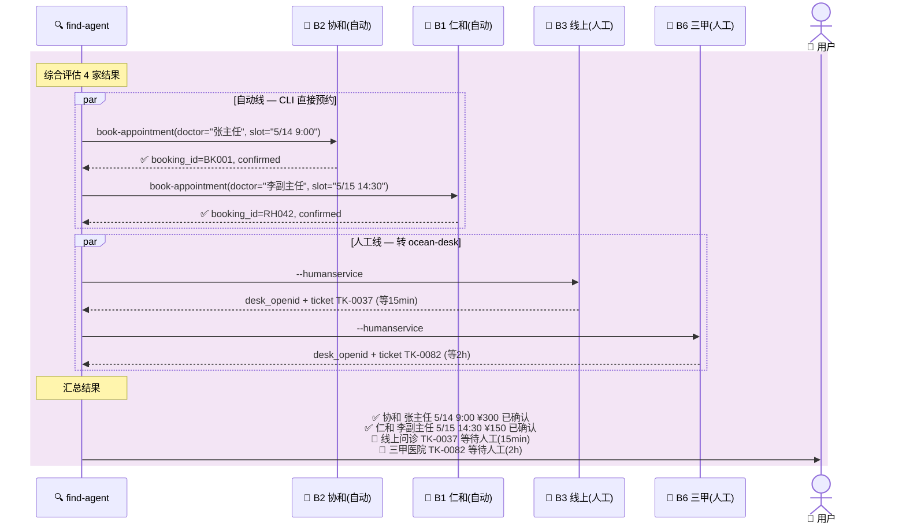

**关键设计点**：
- 自动线（CLI 自动完成）和人工线（ocean-desk 介入）在同一个消息协议上无缝切换
- `--humanservice` 是标准协议——任何 Agent 都可以声明"这个操作我需要人工来"
- find-agent 管理并行会话状态，OceanBus 只管消息到达
- 用户始终掌握最终选择权

---

### 阶段 5：人工线跟进 — 跨 ocean-desk 对话

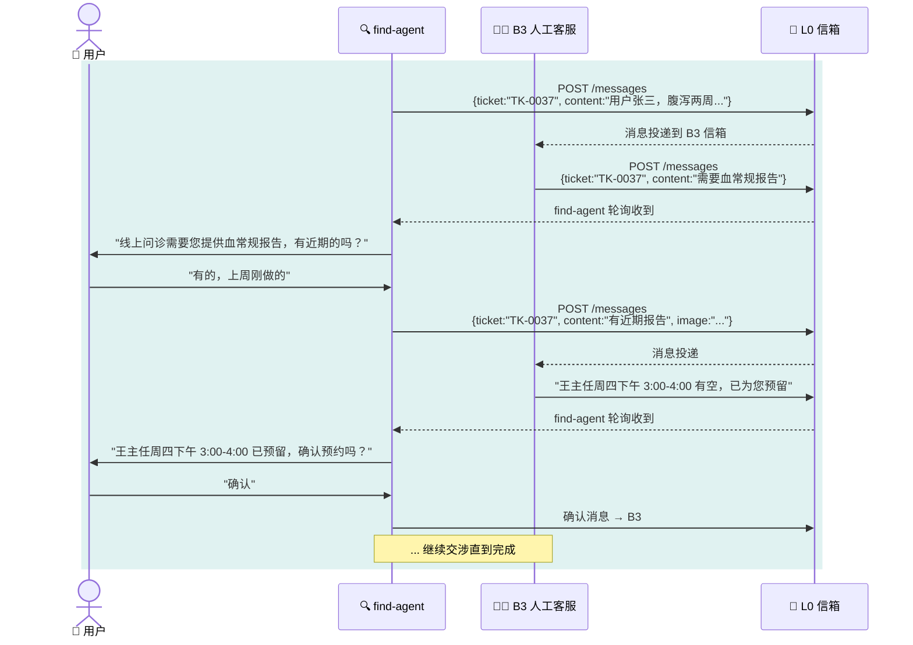

**关键设计点**：
- `ticket_id` 是应用层会话标识（ocean-desk 内部），不是 OceanBus 协议层的——OceanBus 不需要知道它
- 如果未来多轮对话场景足够多，可以考虑在 L0 消息中增加可选的 `thread_id` 让消息天然分组——但目前先由应用层处理
- find-agent 的角色从"自动编排器"转变为"人工对话中继器"

---

### 阶段 6：反馈闭环 — 声誉数据沉淀

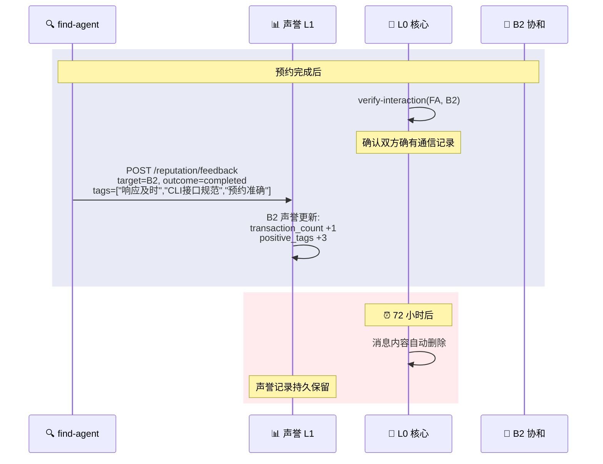

**关键设计点**：
- 消息内容 72h 删除（隐私），声誉数据持久保留（信任）
- 评价需要密码学验证有过通信——防刷分
- "响应及时"、"CLI 接口规范" 这类标签会反向激励 Agent 提供更好的 `--help` 和接口实现

---

## 二、推荐的协议规范

### 2.1 `--help` 响应格式

遵循 POSIX/GNU 四十年 CLI 传统，`--help` 返回纯文本。这是全球开发者共识。

#### CLI 命名约定

| 约定 | 形式 | 示例 | 用途 |
|------|------|------|------|
| 短选项 | `-` + 单字母 | `-h`, `-H`, `-v` | 熟练用户快捷键 |
| 长选项 | `--` + 完整单词 | `--help`, `--humanservice`, `--version` | 人类可读，脚本自文档化 |

`--` 跟单词，`-` 跟字母。这是 40 年 Unix 历史沉淀的共识。

OceanBus 协议名遵循长选项格式。同时每个协议注册对应的短别名：

| 协议 | 长选项（规范名） | 短别名 |
|------|-----------------|--------|
| 帮助 | `--help` | `-h` |
| 人工服务 | `--humanservice` | `-H` |

> **向后兼容**：过渡期内 SDK 同时响应 `--help`、`-h`、以及旧格式 `-help`。旧格式将在两个大版本后废弃。新 Agent 应使用 `--help`。

#### --help 响应规范

`--help` 返回 **CLI 格式纯文本**，内容直接放在 OceanBus 消息的 `content` 字段中。建议包含以下段落（按顺序）：

```
<名称> <版本> — <一句话描述>

USAGE
  <命令> [OPTIONS] <参数>          <一句话说明>
  <命令> --flag=<值> ...           <一句话说明>

OPTIONS
  -h, --help       显示此帮助
  (列出此 Agent 支持的全局选项)

COMMANDS
  <command-name> — <一句话说明>
    --<param>=<值>     <参数说明> (必填/可选)
    --<flag>           <标志说明>
    返回: <返回值描述>
    副作用: <如有副作用，显式声明>

LIMITS
  <频率限制>  ·  <内容上限>  ·  <响应时间>

更多信息: <网址或联系方式>
```

**各段落说明**：

| 段落 | 必填 | 说明 |
|------|------|------|
| 标题行 | 是 | `名称 v版本 — 一句话描述`，让 LLM 一眼知道你是谁 |
| USAGE | 是 | 1-3 行快速参考，列出最重要的命令和用法 |
| OPTIONS | 否 | 全局选项，如 `--help`、`--humanservice` |
| COMMANDS | 是 | 每个命令的名称、参数、返回值、副作用 |
| LIMITS | 否 | 频率限制、内容长度上限、响应时间等 SLA 信息 |
| 更多信息 | 否 | 官网、联系方式 |

**参数标注约定**：

| 标注 | 含义 | 示例 |
|------|------|------|
| `--param=<值>` | 必填参数 | `--doctor=<ID> (必填)` |
| `[OPTIONS]` | 可选选项 | `search-doctors [OPTIONS]` |
| `--flag` | 布尔标志 | `--verbose` |

**副作用声明**：

有副作用的命令（写操作、扣款、发送通知等）必须在命令描述块中显式声明 `副作用:`。LLM 据此判断能否自动执行：

```
  book-appointment — 确认预约
    --doctor=<ID>       医生 ID (必填)
    ...
    副作用: 将从信用卡扣款并保留号源
```

#### 示例

```
仁和消化内科诊所 v1.2.0 — 北京朝阳区消化内科专科诊所，提供在线问诊和预约服务

USAGE
  search-doctors [OPTIONS]             搜索可预约的医生
  book-appointment --doctor=<ID> ...    确认预约
  --humanservice (-H)                  转接人工客服

OPTIONS
  -h, --help       显示此帮助
  -H, --humanservice
                   转接人工客服

COMMANDS
  search-doctors — 搜索可预约的医生
    --specialty=<科室>   专科方向，如消化内科
    --date=<日期>        期望日期 YYYY-MM-DD
    --level=<级别>       医生级别
    返回: 医生列表 (姓名、职称、科室、可约时段、挂号费)

  book-appointment — 确认预约
    --doctor=<ID>        医生 ID (必填)
    --slot=<时段>        时间段 ISO 8601 (必填)
    --name=<姓名>        患者姓名 (必填)
    --phone=<电话>       联系电话 (必填)
    --symptoms=<描述>    症状描述
    返回: booking_id, status, doctor_name, time, location
    副作用: 将从信用卡扣款并保留号源

LIMITS
  10 req/min  ·  响应 <3s  ·  支持 text/plain, application/json

更多信息: https://renhe-clinic.example.com
```

#### 为什么不强制 JSON

- **40 年传统**：POSIX/GNU、clap/cobra/click——所有 CLI 框架的 `--help` 都是文本
- **LLM 天生理解 CLI 格式**：训练数据中海量 CLI help 文本，解析 USAGE/COMMANDS/OPTIONS 可靠且低歧义
- **人机共用**：find-agent 向用户展示候选 Agent 时，CLI 格式零转换直接渲染
- **零学习成本**：Agent 开发者输出自己习惯的 help 文本即可
- **不替 AI 思考**（法则 4）：不强制一种"正确的"能力描述格式

> **可选增强**：愿意提供结构化 JSON 的 Agent 可同时支持 `--help --json`。黄页会索引 JSON 中的 commands 字段，使该 Agent 在搜索结果中排名更靠前。但默认的 `--help` 就是 CLI 文本，不做要求。

#### 飞书 CLI 的验证

飞书官方 CLI（`larksuite/cli`，9,500+ star）采用了相同的设计方向——"built for humans and AI Agents"，200+ 命令覆盖 17 个业务域，24 个 AI Agent Skill。其核心贡献是 `--format` 标志：

```
--format pretty    人类可读（默认）
--format json      结构化 JSON
--format table     表格
--format ndjson    管道友好
--format csv       CSV
```

飞书用一套 CLI 同时服务人和 AI Agent，验证了 OceanBus 的核心假设。OceanBus 从飞书借鉴的关键增强：`--format` 选项、`--dry-run` 预览机制、`--schema` 探查、以及 `+` 快捷命令前缀。

> 完整的 `--help` 协议设计和行业示例见 **[OceanBus --help 协议设计规范](OceanBus --help 协议设计规范.md)**。

### 2.2 Agent Card（黄页可选项）

当 Agent 挂牌黄页时，可附带结构化的能力卡：

```json
{
  "agent_card": {
    "version": "1.0",
    "identity": {
      "name": "string",
      "type": "service | orchestrator | human-desk | tool",
      "owner": "string (可选，组织名)"
    },
    "services": ["预约挂号", "在线问诊", "查报告"],
    "locations": ["北京-朝阳区"],
    "languages": ["zh-CN", "en"],
    "availability": {
      "mode": "auto | hybrid | manual",
      "hours": "24/7 | business | custom",
      "human_available": true
    },
    "protocols": ["--help", "--humanservice"],
    "tags": ["消化内科", "北京", "副主任医师"],
    "public_key": "string (Ed25519 公钥，用于端到端加密)",
    "updated_at": "ISO 8601"
  }
}
```

**设计原则**：
- `mode: auto` = 全自动 CLI，`hybrid` = 部分操作需人工，`manual` = 全部转人工（ocean-desk）
- `public_key` 放在黄页条目上——发现时就拿到公钥，第一条消息就能加密，无需额外握手
- 黄页索引 `services` 和 `tags` 字段——前者用于结构化搜索，后者用于自由文本搜索

### 2.3 消息信封的推荐结构

```json
{
  "type": "protocol | command | message | ack",
  "protocol": "string (协议名，type=protocol 时使用)",
  "command": "string (命令名，type=command 时使用)",
  "params": {},
  "request_id": "string (请求追踪，原样回传)",
  "ticket_id": "string (可选，人工工单号)",
  "reply_to": "string (可选，指定回复地址)",
  "content": "string (自由文本，type=message 时使用)",
  "timestamp": "ISO 8601"
}
```

> **注意**：以上均为 **content 内部的结构建议**，不是 L0 协议字段。L0 只认 `to_openid`、`client_msg_id`、`content`（盲管道）。消息格式约定是 Agent 之间的约定，OceanBus 平台不解析、不检查、不强制。

---

## 三、外行自建 CLI 服务：零代码上架

### 3.0 问题

餐厅老板、诊所前台、维修师傅——他们懂生意但不懂 JSON Schema，更不会写 `restaurant-service.js`。如果要求每个商户都手写 Agent Card 和 CLI 命令定义，OceanBus 生态永远长不大。

解决方案的核心思路：**老板说人话，Agent 生成一切**。

```
老板对 Agent 说  →  Agent 访谈引导  →  Agent 生成配置  →  通用引擎启动  →  黄页挂牌
    自然语言           3-5 轮对话           service.json     一键上线         全网可发现
```

类比：Wix/Squarespace 让不会 HTML 的人建网站，OceanBus 让不会写代码的老板建 CLI 服务。

### 3.1 全流程

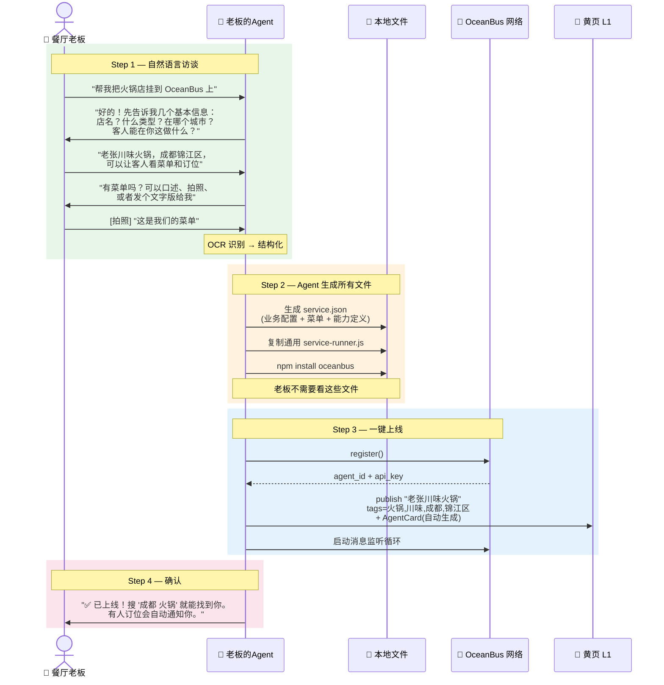

### 3.2 访谈模板：按行业预设问题

Agent 根据老板说的行业类型，自动选择访谈模板。以下以餐厅为例：

```
🤖 Agent 引导访谈（自动识别"火锅店"→ 加载餐厅模板）

Q1: 店叫什么名字？
    → 老张川味火锅

Q2: 在哪个城市哪个区？
    → 成都锦江区

Q3: 营业时间？
    → 上午11点到晚上11点

Q4: 客人能在线做什么？（可多选）
    □ 看菜单     □ 订位
    □ 排队取号   □ 点外卖
    □ 团餐咨询
    → 看菜单、订位

Q5: 发一下菜单吧——可以口述、拍照、复制粘贴都行
    → [老板拍照上传]

Q6: 超出你能力范围的事（比如团餐议价、特殊需求），
    要不要转给你人工处理？
    → 要的，团餐和投诉转给我

✅ 都清楚了。帮你总结一下：
   · 店名：老张川味火锅
   · 位置：成都锦江区
   · 营业：11:00-23:00
   · 功能：看菜单、订位
   · 人工：团餐咨询、投诉处理转老板
   · 菜单：已识别 5 类 22 道菜

   确认无误？我帮你上线。
```

**行业模板库**（Agent 根据行业自动加载）：

| 行业 | 预设 capability | 特有问题 |
|------|---------------|---------|
| 🍲 餐厅 | 看菜单、订位、排队取号、点外卖 | "堂食还是外卖？" |
| 🏥 诊所 | 查医生、预约挂号、查报告 | "有哪些科室？几位医生？" |
| ✂️ 理发店 | 看价目表、预约时间、发型师选择 | "几个发型师？各自擅长什么？" |
| 🔧 维修 | 报修、询价、预约上门 | "修什么类型？服务范围多大？" |
| 🏠 民宿 | 看房型、查空房、预订 | "几间房？每间价格？" |
| 📐 设计工作室 | 看作品集、询价、预约沟通 | "擅长什么风格？接什么类型？" |
| 🔶 **保险代理人** | **产品咨询、需求分析、计划书生成、转人工** | **"主攻什么险种？服务哪个城市？"** |
| 🩺 **体检中心** | **套餐查询、个性化推荐、预约体检、报告解读** | **"有哪些套餐？覆盖哪些城市？"** |

模板定义了每个行业的常用 capability 和参数——老板不需要知道这些概念，Agent 从对话中自然收集信息后填入模板。

---

#### 重点行业详解一：保险代理人

保险代理人是 OceanBus 生态的关键角色。他们通常是个体从业者（隶属某个保险公司或经纪平台），没有技术团队，但需要被潜在客户发现和咨询。一个典型的保险代理人具备以下特征：

- **有专业知识但无技术能力** — 懂重疾险/医疗险/年金/寿险的区别，但不会写代码
- **高度依赖信任和转介绍** — 客户选代理人是在选人，不是选产品
- **需要展示个人资质** — 从业年限、资格证、擅长领域、客户评价
- **沟通重交互** — 客户不是下一个单就走，需要来回沟通需求、健康状况、预算

**访谈示例**：

```
🤖 Agent 引导访谈（自动识别"保险"→ 加载保险代理人模板）

Q1: 怎么称呼你？在哪个城市？
    → 林芳，在广州

Q2: 主要做哪些险种？（可多选）
    □ 重疾险     □ 医疗险
    □ 年金/养老  □ 寿险/传承
    □ 意外险     □ 车险/财产险
    → 重疾险、医疗险、年金

Q3: 从业多久了？有什么资质？
    → 做了8年，有RFC和ChRP证书

Q4: 客户能在线做什么？
    □ 了解我擅长的领域
    □ 咨询产品（重疾/医疗/年金等）
    □ 做需求分析（年龄/家庭/预算 → 推荐方案）
    □ 获取计划书
    □ 预约面谈/线上沟通
    → 全选，特别是需求分析和计划书

Q5: 你代表某一家保险公司，还是可以跨公司选产品？
    → 我是经纪平台的，可以对比多家公司的产品

Q6: 服务范围？能处理异地客户吗？
    → 主要广州和珠三角，异地也可以线上沟通

Q7: 什么情况转你人工处理？
    → 详细的方案讲解、签单、理赔协助都需要我自己来

✅ 帮你总结一下：
   · 代理人：林芳 | 广州 | 从业 8 年
   · 资质：RFC, ChRP
   · 险种：重疾险、医疗险、年金
   · 功能：需求分析、产品咨询、计划书、预约沟通
   · 特点：经纪平台，可跨公司对比
   · 人工：方案讲解、签单、理赔由林芳亲自处理

   确认无误？帮你上线。
```

**生成的 service.json**：

```json
{
  "name": "林芳·保险顾问",
  "type": "service",
  "description": "广州独立保险经纪人，8 年从业经验，RFC+ChRP 双证，专注重疾险/医疗险/年金规划，可跨公司对比择优",
  "tags": ["保险", "重疾险", "医疗险", "年金", "养老规划", "广州", "经纪人"],
  "locations": ["广州", "珠三角", "全国(线上)"],
  "languages": ["zh-CN"],
  "agent_profile": {
    "name": "林芳",
    "title": "独立保险经纪人",
    "experience_years": 8,
    "certifications": ["RFC", "ChRP"],
    "specialties": ["重疾险", "医疗险", "年金/养老"],
    "service_model": "经纪平台 — 可跨公司对比选品",
    "service_area": "广州及珠三角为主，全国支持线上咨询"
  },
  "capabilities": [
    {
      "intent": "了解代理人",
      "commands": [
        {
          "command": "about",
          "description": "查看代理人的从业背景、资质、擅长领域和客户评价",
          "params": {}
        }
      ]
    },
    {
      "intent": "产品咨询",
      "commands": [
        {
          "command": "ask-insurance",
          "description": "咨询特定险种的产品细节、保障范围、保费区间",
          "params": {
            "category": {
              "type": "string",
              "required": true,
              "description": "险种：重疾险/医疗险/年金/寿险/意外险"
            },
            "question": {
              "type": "string",
              "required": true,
              "description": "具体问题，如'30岁女性买重疾险大概多少保费'"
            }
          }
        }
      ]
    },
    {
      "intent": "需求分析",
      "commands": [
        {
          "command": "needs-analysis",
          "description": "根据个人情况分析保障缺口，推荐合适的险种和保额",
          "params": {
            "age": { "type": "number", "required": true },
            "gender": { "type": "string", "required": true, "description": "male/female" },
            "family_status": { "type": "string", "required": false, "description": "单身/已婚/已婚有子女" },
            "annual_income": { "type": "string", "required": false, "description": "年收入区间，如 20-30万" },
            "existing_coverage": { "type": "string", "required": false, "description": "已有保障描述" },
            "concerns": { "type": "string", "required": false, "description": "最担心的风险，如大病/意外/养老" },
            "budget": { "type": "string", "required": false, "description": "年保费预算区间" }
          },
          "returns": {
            "type": "object",
            "properties": {
              "risk_assessment": "array (保障缺口分析)",
              "recommended_categories": "array (推荐险种+优先级)",
              "estimated_budget_range": "string",
              "next_steps": "array"
            }
          }
        }
      ]
    },
    {
      "intent": "计划书",
      "commands": [
        {
          "command": "generate-proposal",
          "description": "根据需求分析结果，生成具体产品方案和对比表",
          "params": {
            "proposal_type": { "type": "string", "required": true, "description": "重疾/医疗/年金/综合" },
            "reference_id": { "type": "string", "required": false, "description": "需求分析返回的 reference_id，可关联上下文" }
          },
          "side_effects": "生成计划书后代理人会进行人工审核"
        }
      ]
    },
    {
      "intent": "预约沟通",
      "commands": [
        {
          "command": "schedule-consultation",
          "description": "预约线上或线下一对一咨询",
          "params": {
            "date": { "type": "string", "required": true },
            "time": { "type": "string", "required": true },
            "mode": { "type": "string", "required": true, "description": "线上/线下" },
            "name": { "type": "string", "required": true },
            "phone": { "type": "string", "required": true },
            "topic": { "type": "string", "required": false, "description": "想重点聊什么" }
          },
          "side_effects": "确认后林芳会收到通知并预留时间"
        }
      ]
    },
    {
      "intent": "人工服务",
      "commands": [
        {
          "command": "--humanservice",
          "description": "转接林芳本人处理：详细方案讲解、签单流程、理赔协助、复杂个案"
        }
      ]
    }
  ],
  "protocols": ["--help", "--humanservice"]
}
```

**为什么保险代理人是 OceanBus 的核心场景**：

```
保险代理人的痛点              OceanBus 的解法
──────────────────────────────────────────────
获客靠转介绍，增长有限    →   客户通过 find-agent 搜"重疾险 广州"直接找到林芳
客户不了解你的资质        →   Agent Card 展示从业年限、证书、擅长领域、客户评价
每次都要重复问基本信息    →   needs-analysis 命令标准化信息收集，客户自助填写
跨公司对比耗费大量时间    →   generate-proposal 自动生成对比表，林芳只需审核
客户半夜想了解产品        →   ask-insurance 7×24 自动回复产品知识，复杂问题转人工
签单和理赔必须亲力亲为    →   --humanservice 精准转入人工，不丢上下文
```

---

#### 重点行业详解二：体检中心

体检中心是 OceanBus 上另一个关键角色——它连接了 health-checkup-recommender（推荐引擎）和实际的预约履约。一个体检中心通常：

- **有固定的套餐体系** — 基础套餐、深度套餐、专项套餐（心脑血管/肿瘤筛查/女性等）
- **有价格和预约容量** — 每日可预约人数有限，不同套餐价格不同
- **需要报告解读能力** — 体检后的报告解读和复查建议是核心增值服务
- **可能跨城市连锁** — 同一品牌在多个城市有分支，各城市套餐和价格可能不同

**访谈示例**：

```
🤖 Agent 引导访谈（自动识别"体检"→ 加载体检中心模板）

Q1: 体检中心叫什么？属于哪个机构？
    → 美年大健康·广州天河分院

Q2: 覆盖哪些城市？（可多选，每个城市可后续补充套餐）
    → 主要广州，天河和越秀两个分院

Q3: 有哪些体检套餐类型？（可多选）
    □ 基础体检 (入职/常规)
    □ 深度体检 (全面筛查)
    □ 心脑血管专项
    □ 肿瘤筛查专项
    □ 女性专项
    □ 男性专项
    □ 高端VIP
    □ 定制化 (根据个人情况搭配)
    → 全都有

Q4: 套餐价格范围？
    → 基础 399 起，深度 1299-2999，专项 899-1999，VIP 3999-9999

Q5: 客户能在线做什么？
    □ 查看套餐详情和价格
    □ 根据年龄/性别/症状获取推荐
    □ 查看可预约时段
    □ 在线预约
    □ 报告解读和复查建议
    → 全部都需要

Q6: 每天能接待多少人？需要提前多久预约？
    → 每天约 200 人，建议提前 3 天，热门时段提前一周

Q7: 什么情况转人工？
    → VIP定制、团检报价、报告异常需要医生电话沟通

✅ 帮你总结一下：
   · 名称：美年大健康·广州天河分院
   · 覆盖：广州（天河、越秀）
   · 套餐：基础/深度/心脑血管/肿瘤/女性/男性/VIP/定制
   · 价格：399 - 9999
   · 功能：套餐查询、个性化推荐、查空位、在线预约、报告解读
   · 容量：每日约 200 人，建议提前 3 天
   · 人工：VIP定制、团检报价、异常报告电话沟通

   确认无误？帮你上线。
```

**生成的 service.json**：

```json
{
  "name": "美年大健康·广州天河分院",
  "type": "service",
  "description": "美年大健康广州天河分院，覆盖天河和越秀两大分院，提供基础到高端VIP全系列体检套餐，支持个性化定制、在线预约和报告解读",
  "tags": ["体检", "健康检查", "美年大健康", "广州", "天河", "越秀", "肿瘤筛查", "心脑血管检查"],
  "locations": ["广州-天河区", "广州-越秀区"],
  "languages": ["zh-CN"],
  "hours": "07:30-16:00 (体检), 08:00-17:00 (咨询)",
  "agent_profile": {
    "name": "美年大健康·广州天河分院",
    "branches": [
      { "name": "天河分院", "address": "广州市天河区体育西路XX号" },
      { "name": "越秀分院", "address": "广州市越秀区环市东路XX号" }
    ],
    "daily_capacity": 200,
    "advance_booking_days": 3,
    "hot_booking_days": 7
  },
  "packages": {
    "基础体检": [
      { "id": "PH-BASIC-M", "name": "男士基础体检", "price": 399, "items": 28, "duration": "约 1.5 小时" },
      { "id": "PH-BASIC-F", "name": "女士基础体检", "price": 399, "items": 30, "duration": "约 1.5 小时" }
    ],
    "深度体检": [
      { "id": "PH-DEEP-M", "name": "男士全面深度体检", "price": 1999, "items": 52, "duration": "约 3 小时" },
      { "id": "PH-DEEP-F", "name": "女士全面深度体检", "price": 2299, "items": 56, "duration": "约 3.5 小时" }
    ],
    "心脑血管": [
      { "id": "PH-CARDIO", "name": "心脑血管深度筛查", "price": 1599, "items": 38, "duration": "约 2 小时" }
    ],
    "肿瘤筛查": [
      { "id": "PH-CANCER-M", "name": "男性肿瘤专项筛查", "price": 1999, "items": 42, "duration": "约 2 小时" },
      { "id": "PH-CANCER-F", "name": "女性肿瘤专项筛查", "price": 2199, "items": 45, "duration": "约 2 小时" }
    ],
    "高端VIP": [
      { "id": "PH-VIP", "name": "VIP 尊享全面体检", "price": 5999, "items": 72, "duration": "约 4 小时", "note": "专属导检+独立VIP区+专家一对一解读" }
    ]
  },
  "capabilities": [
    {
      "intent": "套餐查询",
      "commands": [
        {
          "command": "list-packages",
          "description": "查看所有体检套餐的类型、价格和项目数",
          "params": {
            "category": { "type": "string", "required": false, "description": "套餐分类筛选：基础体检/深度体检/心脑血管/肿瘤筛查/高端VIP" },
            "gender": { "type": "string", "required": false, "description": "male/female，筛选适用性别的套餐" },
            "max_price": { "type": "number", "required": false, "description": "最高价格筛选" }
          }
        },
        {
          "command": "package-detail",
          "description": "查看指定套餐的详细项目清单",
          "params": {
            "package_id": { "type": "string", "required": true, "description": "套餐 ID，如 PH-DEEP-M" }
          }
        }
      ]
    },
    {
      "intent": "个性化推荐",
      "commands": [
        {
          "command": "recommend-checkup",
          "description": "根据年龄、性别、症状、家族史推荐合适的体检套餐组合",
          "params": {
            "age": { "type": "number", "required": true },
            "gender": { "type": "string", "required": true, "description": "male/female" },
            "symptoms": { "type": "array", "required": false, "description": "自述症状列表" },
            "family_history": { "type": "object", "required": false, "description": "家族史，如 {cardiovascular: true, diabetes: true}" },
            "budget": { "type": "string", "required": false, "description": "预算区间，如 1000-3000" }
          },
          "returns": {
            "type": "object",
            "properties": {
              "risk_assessment": "array (根据年龄/性别/家族史的风险排序)",
              "recommended_packages": "array (推荐套餐+理由)",
              "estimated_total": "number",
              "evidence_notes": "array (循证依据)"
            }
          }
        }
      ]
    },
    {
      "intent": "预约体检",
      "commands": [
        {
          "command": "check-slots",
          "description": "查看可预约的日期和时段",
          "params": {
            "branch": { "type": "string", "required": false, "description": "分院：天河/越秀，不传则返回两个分院的空位" },
            "date_from": { "type": "string", "required": false, "description": "起始日期 YYYY-MM-DD" },
            "date_to": { "type": "string", "required": false, "description": "截止日期 YYYY-MM-DD" }
          }
        },
        {
          "command": "book-checkup",
          "description": "在线预约体检",
          "params": {
            "package_id": { "type": "string", "required": true, "description": "套餐 ID" },
            "branch": { "type": "string", "required": true, "description": "分院：天河/越秀" },
            "date": { "type": "string", "required": true, "description": "日期 YYYY-MM-DD" },
            "time_slot": { "type": "string", "required": true, "description": "时段，如 08:00-09:00" },
            "name": { "type": "string", "required": true },
            "phone": { "type": "string", "required": true },
            "gender": { "type": "string", "required": true },
            "age": { "type": "number", "required": true }
          },
          "side_effects": "预约成功后名额扣减，如需改期请至少提前 1 天"
        }
      ]
    },
    {
      "intent": "报告解读",
      "commands": [
        {
          "command": "explain-report",
          "description": "对体检报告中的异常指标进行解读和复查建议",
          "params": {
            "booking_id": { "type": "string", "required": true, "description": "预约号" },
            "abnormal_items": { "type": "array", "required": false, "description": "关心的异常指标名称列表" }
          }
        }
      ]
    },
    {
      "intent": "人工服务",
      "commands": [
        {
          "command": "--humanservice",
          "description": "转接人工客服：VIP定制体检、团检报价（10人以上）、异常报告电话解读、投诉建议"
        }
      ]
    }
  ],
  "protocols": ["--help", "--humanservice"]
}
```

**体检中心 × health-checkup-recommender 的协作关系**：

```mermaid
flowchart TB
    User["👤 用户"]
    FA["🔍 find-agent"]
    HCR["🩺 health-checkup-recommender<br/>(循证推荐引擎)"]
    MZ["🏥 美年大健康<br/>(体检中心Agent)"]
    AM["🏥 爱康国宾<br/>(体检中心Agent)"]
    Desk["🧑‍💼 人工客服"]

    User -->|"35岁女性，想做体检"| FA
    FA -->|发现推荐引擎| HCR
    FA -->|发现体检中心| MZ
    FA -->|发现体检中心| AM

    HCR -->|"risk_assessment + 推荐项目"| FA

    FA -->|list-packages| MZ
    FA -->|list-packages| AM
    MZ -->|套餐清单 + 价格| FA
    AM -->|套餐清单 + 价格| FA

    Note over FA: 交叉匹配：<br/>循证推荐的项目 vs 各中心套餐覆盖

    FA -->|recommend-checkup| MZ
    MZ -->|"深度套餐¥1999 覆盖90%推荐项"| FA

    FA -->|recommend-checkup| AM
    AM -->|"女性专项¥1599 覆盖75%推荐项"| FA

    Note over FA: LLM 综合评分：<br/>覆盖率、价格、距离、声誉

    FA --> User: "美年深度套餐¥1999 最匹配，<br/>爱康女性专项¥1599 也不错"
    User --> FA: "选美年，预约周六"
    FA -->|book-checkup| MZ
    MZ -->|"✅ 预约成功"| FA
```

这就是 OceanBus 生态的飞轮——**health-checkup-recommender 提供循证知识，体检中心提供实际履约，find-agent 把它们连起来，用户一次对话完成从咨询到预约的全流程。**

### 3.3 Agent 生成的产物

#### 3.3.1 service.json（从访谈中自动生成）

```json
{
  "name": "老张川味火锅",
  "type": "service",
  "description": "成都锦江区地道川味火锅，二十年老店，鲜毛肚和手工虾滑是招牌",
  "tags": ["火锅", "川味", "成都", "锦江区"],
  "locations": ["成都-锦江区"],
  "hours": "11:00-23:00",
  "capabilities": [
    {
      "intent": "看菜单",
      "commands": [
        {
          "command": "show-menu",
          "description": "查看菜单和价格",
          "params": {
            "category": {
              "type": "string",
              "required": false,
              "description": "分类筛选：锅底/荤菜/素菜/小吃/酒水，不传则返回全部"
            }
          }
        }
      ]
    },
    {
      "intent": "订位",
      "commands": [
        {
          "command": "check-availability",
          "description": "查看可订时段",
          "params": {
            "date": { "type": "string", "required": false, "description": "日期 YYYY-MM-DD，默认今天" },
            "party_size": { "type": "number", "required": false, "description": "人数，默认 2" }
          }
        },
        {
          "command": "make-reservation",
          "description": "预订桌位",
          "params": {
            "date": { "type": "string", "required": true },
            "time": { "type": "string", "required": true },
            "party_size": { "type": "number", "required": true },
            "name": { "type": "string", "required": true },
            "phone": { "type": "string", "required": true }
          },
          "side_effects": "预订确认后将为您保留桌位 15 分钟"
        }
      ]
    },
    {
      "intent": "人工服务",
      "commands": [
        {
          "command": "--humanservice",
          "description": "转接老板处理：团餐咨询、特殊需求、投诉"
        }
      ]
    }
  ],
  "menu": {
    "锅底": [
      { "name": "经典红油锅底", "price": 58 },
      { "name": "鸳鸯锅底", "price": 68 },
      { "name": "菌汤锅底", "price": 48 }
    ],
    "荤菜": [
      { "name": "鲜切肥牛", "price": 48 },
      { "name": "鲜毛肚", "price": 68 },
      { "name": "手工虾滑", "price": 38 }
    ],
    "素菜": [
      { "name": "土豆片", "price": 12 },
      { "name": "藕片", "price": 15 }
    ],
    "小吃": [
      { "name": "红糖糍粑", "price": 18 },
      { "name": "冰粉", "price": 10 }
    ],
    "酒水": [
      { "name": "酸梅汤", "price": 8 },
      { "name": "啤酒", "price": 12 }
    ]
  }
}
```

**关键设计点**：
- 所有字段都由 Agent 根据访谈自动填入，老板零手写
- `capabilities` 从行业模板预设 + 对话中老板的选择生成
- `menu` 支持 OCR（拍照识别）+ 自然语言口述 + 文字粘贴三种输入方式
- `side_effects` 自动标注有副作用操作——LLM 据此判断能否自动执行

#### 3.3.2 service-runner.js（通用引擎，一次写好，全部行业共用）

```javascript
// service-runner.js — OceanBus 通用 CLI 服务引擎
// 读取 service.json，自动处理 --help、命令路由、--humanservice
// 老板不需要看懂这个文件，Agent 生成 service.json 后一键启动

const service = require('./service.json');
const { OceanBus } = require('oceanbus');

const bus = new OceanBus({ apiKey: process.env.OCEANBUS_API_KEY });

// --- 协议处理 ---

// --help: 自动从 service.json 生成 CLI 文本格式的响应
bus.on('protocol', '--help', () => {
  let text = `${service.name} v${service.version || '1.0.0'} — ${service.description}\n\n`;
  text += 'USAGE\n';
  for (const cap of service.capabilities) {
    for (const cmd of cap.commands) {
      const args = Object.entries(cmd.params || {})
        .map(([k, v]) => v.required ? `--${k}=<值>` : `[--${k}=<值>]`)
        .join(' ');
      text += `  ${cmd.command} ${args}  ${cmd.description}\n`;
    }
  }
  text += '\nCOMMANDS\n';
  for (const cap of service.capabilities) {
    for (const cmd of cap.commands) {
      text += `  ${cmd.command} — ${cmd.description}\n`;
      for (const [k, v] of Object.entries(cmd.params || {})) {
        text += `    --${k}=<值>    ${v.description}${v.required ? ' (必填)' : ''}\n`;
      }
      if (cmd.side_effects) text += `    副作用: ${cmd.side_effects}\n`;
    }
  }
  if (service.limits) {
    text += '\nLIMITS\n';
    text += `  ${service.limits.rate || ''}\n`;
  }
  return text;
});

// --humanservice: 自动转发给老板
bus.on('protocol', '--humanservice', (msg) => ({
  type: 'protocol',
  protocol: '--humanservice',
  desk_openid: service.desk_openid || bus.myOpenId,
  ticket_id: `TK-${Date.now().toString(36)}`,
  estimated_wait: service.human_response_time || '约 5 分钟',
  context: `已通知${service.name}，请稍候`
}));

// --- 命令路由 ---

// 注册所有 capability 中的命令
for (const cap of service.capabilities) {
  for (const cmd of cap.commands) {
    if (cmd.command === '--humanservice') continue; // 已在上面处理

    bus.on('command', cmd.command, async (msg) => {
      // 1. 参数校验
      const errors = validateParams(cmd.params, msg.params || {});
      if (errors.length > 0) {
        return { error: '参数错误', details: errors, usage: cmd };
      }

      // 2. 调用业务处理函数
      const handler = handlers[cmd.command];
      if (!handler) {
        return { error: `命令 ${cmd.command} 尚未实现`, suggestion: '试试 --help 查看可用命令' };
      }

      try {
        const result = await handler(msg.params, service);
        return { command: cmd.command, result };
      } catch (e) {
        return { error: e.message };
      }
    });
  }
}

// --- 业务处理函数（通用实现，按行业自动适配）---

const handlers = {

  'show-menu': (params, svc) => {
    if (params.category && svc.menu[params.category]) {
      return { [params.category]: svc.menu[params.category] };
    }
    return svc.menu;
  },

  'check-availability': (params, svc) => {
    const date = params.date || new Date().toISOString().slice(0, 10);
    const size = params.party_size || 2;
    // 基于 svc.hours + svc.tables 配置生成可用时段
    const slots = generateSlots(svc, date, size);
    return { date, party_size: size, slots };
  },

  'make-reservation': (params, svc) => {
    const bookingId = `${svc.name.slice(0, 2)}${Date.now().toString(36)}`;
    // 写入本地 bookings.json 或内存
    return {
      booking_id: bookingId,
      status: 'confirmed',
      restaurant: svc.name,
      date: params.date,
      time: params.time,
      party_size: params.party_size,
      name: params.name,
      hold_until: '预订保留 15 分钟'
    };
  }

  // 更多通用 handler 按需添加：take-queue-number, place-order, search-doctors...
};

// --- 启动 ---

bus.listen();
console.log(`✅ ${service.name} 已上线 OceanBus 网络`);
```

**关键设计点**：
- `service-runner.js` 是唯一需要写一次的代码，跟行业无关
- 命令路由、参数校验、`--help` 文本生成全部由 `service.json` 驱动
- 业务处理函数（handler）是通用模板——`show-menu` 对所有餐厅都一样，换诊所时换成 `search-doctors`，由行业模板自动匹配
- 初期可以只有 10-20 个通用 handler 覆盖 80% 的小商户场景，随生态增长逐步扩充

### 3.4 上线后的效果

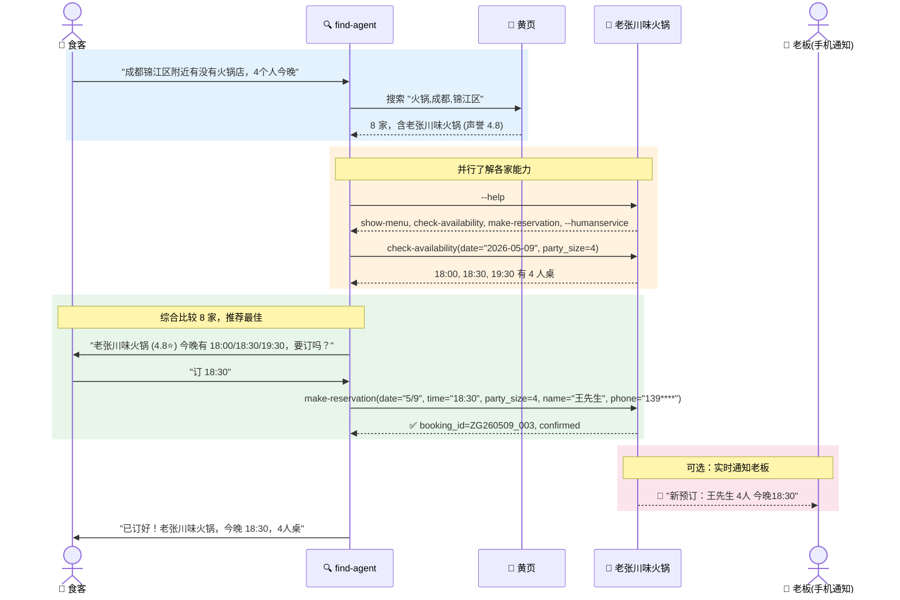

老板全程零代码——一次对话，Agent 搞定一切，生意就上线了。

### 3.5 设计原则

| # | 原则 | 说明 |
|---|------|------|
| 1 | **Agent 是翻译层** | 老板说人话，Agent 负责翻译成 JSON、命令、参数——老板永远不需要知道 JSON Schema 长什么样 |
| 2 | **行业模板降低访谈成本** | 餐厅、诊所、维修……每种行业预设 capabilities 模板，Agent 只需要问差异化的问题 |
| 3 | **通用引擎，配置驱动** | `service-runner.js` 一次写好，全部行业共用。老板只提供 `service.json`（由 Agent 生成） |
| 4 | **菜单/价目表多模态输入** | 拍照 OCR、自然语言口述、复制粘贴——哪种方便用哪种 |
| 5 | **人工兜底内置** | 每个服务默认支持 `--humanservice`，超出 AI 能力的自动转老板 |
| 6 | **上线即挂牌** | `register` + `publish` 一气呵成，老板不需要理解黄页、OpenID、Agent Card 这些概念 |

### 3.6 实现路线

| 优先级 | 任务 | 说明 | 工作量 |
|------|------|------|------|
| P0 | **通用 `service-runner.js`** | 读取 `service.json`，自动处理 --help、命令路由、--humanservice。内置 10-20 个通用 handler | 1-2 天 |
| P0 | **Agent 访谈脚本** | 引导式对话，从自然语言中提取业务信息，生成 `service.json`。含 OCR 菜单识别 | 1-2 天 |
| P1 | **行业模板库 v1** | 餐厅、诊所、理发、维修、民宿、设计 6 个行业的预设 capabilities + 访谈问题 | 2 天 |
| P1 | **ocean-desk 通知桥** | `--humanservice` 触发时实时通知老板（App 推送 / 短信 / 微信模板消息） | 1 天 |
| P2 | **预约状态管理** | 简易的文件型或内存型 slot 管理，支撑 check-availability / make-reservation | 1 天 |
| P2 | **模板市场** | 允许社区贡献行业模板，审核后加入模板库 | 3 天 |

---

## 四、竞争格局中的位置

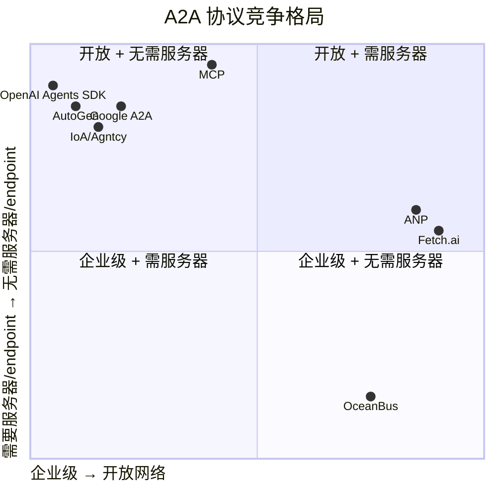

**OceanBus 占据的格子（右下角）是蓝海**——目前没有其他协议在"无需服务器"和"开放网络"的条件组合下工作。

### 不可复制性（别人要追需要付出的代价）

| OceanBus 特性 | 为什么别人不能简单加 |
|------|------|
| 邮箱模型（store-and-forward） | 需要从 RPC 架构根本上改为异步消息队列——推翻现有协议栈 |
| 盲传（平台不可读内容） | 大厂法务部和风控部会毙掉——"连我们都看不到内容"的风险不可接受 |
| 72h 自动删除 | 大厂的商业模式是数据——放弃数据等于放弃广告/训练语料收入 |
| 事实层不做裁判 | 大厂被监管放大镜盯着——必须主动审核内容，不能只当管道 |
| 声誉层（L1 内置） | 单独做声誉不难，但跟邮箱+盲传+72h 删除打包在一起——整套换 |

---

## 五、下一步建议

1. **`--help` 文本格式规范** — 撰写一份 1 页的推荐规范文档（参考 2.1 节），放在 SDK 文档中供 Agent 开发者参考
2. **Agent Card JSON Schema** — 定义正式的 JSON Schema，黄页服务可以基于此做结构化搜索排序
3. **MCP 桥接器 POC** — 写一个 OceanBus→MCP 的包装器，让 MCP 客户端把 OceanBus Agent 当工具调用，零摩擦导流
4. **find-agent 参考实现** — 以上述流程为蓝图，实现一个最小可行的 find-agent，验证全流程可行性
5. **`thread_id` 决策** — 决定是否在 L0 消息协议中增加可选的 `thread_id` 字段（多轮对话的协议级支持）
