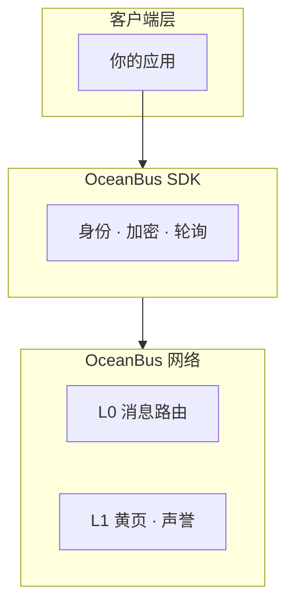

# OceanBus README 统一模板

> 回到 [发布指南总览](../OceanBus%20发布指南.md) | 每次发布 skill 前对照本模板检查 README 结构

---

## 使用说明

本模板适用于 OceanBus 生态下所有 skill 的 `README.md`（GitHub 展示用）。每次新增或更新 skill 时，按本模板结构组织内容。

**与 SKILL.md 的分工**：
- **README.md**：给人类开发者看 — 徽章、安装、用法、架构、生态定位
- **SKILL.md**：给 AI Agent 看 — 行为指南、决策树、协议 Schema、命令速查

README 必须包含指向 SKILL.md 的"深度阅读"链接。

---

## 模板

```markdown
# 🌊 [Project Name] — [一行定位]

[](https://www.npmjs.com/package/oceanbus)
[](https://www.npmjs.com/package/oceanbus)
[](https://clawhub.ai/skills/[slug])
[](LICENSE)

---

## 📑 目录

- [这是什么](#这是什么)
- [快速开始](#快速开始)
- [能力一览](#能力一览)
- [架构](#架构)
- [本地测试](#本地测试)
- [安全](#安全)
- [相关项目](#相关项目)
- [参与贡献](#参与贡献)
- [License](#license)

---

## 这是什么

[2-3 句话说清：项目是什么、解决什么问题]

```
[ASCII 流程图或 mermaid 图]
```

---

## 快速开始

```bash
# 1. 安装
clawhub install [skill-name]

# 2. [第一步操作]
node [script].js [command]

# 3. [验证成功]
node [script].js [verify-command]
```

> 📖 **深度阅读**：[SKILL.md](./SKILL.md) — LLM 行为指南与完整协议文档

---

## 能力一览

| 能力 | 说明 |
|------|------|
| **[能力名]** | [一句话说明] |

---

## 架构



---

## 在 OceanBus 生态中的定位

```
[入门 Skill]  →  [进阶 Skill]  →  [高阶 Skill]
(定位说明)       (定位说明)       (定位说明)
```

---

## 本地测试

```bash
# 连通性测试
node -e "require('./src/index.js')({action:'ping'}).then(r=>console.log(r))"
```

---

## 安全

- [安全要点 1]
- [安全要点 2]

---

## 相关项目

| 项目 | 说明 |
|------|------|
| [oceanbus](https://www.npmjs.com/package/oceanbus) | 核心 SDK — `npm install oceanbus` |
| [oceanbus-mcp-server](https://www.npmjs.com/package/oceanbus-mcp-server) | MCP Server — Claude Desktop/Cursor/百炼通用 |
| [其他相关项目] | [说明] |

---

## 参与贡献

[项目名] 是 [License] 协议的开源项目，欢迎贡献！

- **GitHub**: [repo-url]
- **可参与方向**: [方向列表]
- **深度阅读**: [SKILL.md](./SKILL.md) — LLM 行为指南

---

## License

[License] — [说明]
```

---

## 各节要点

| 节 | 要点 | 常见遗漏 |
|----|------|---------|
| Badges | npm + ClawHub + license 至少三个 | stars 太少时不加 |
| 目录 | GitHub 锚点链接 | 长 README 省略 TOC |
| 这是什么 | 2-3 句 + 配图 | 写成产品说明书 |
| 快速开始 | 复制粘贴可执行，3 步以内 | 步骤超过 5 步 |
| 能力一览 | 用表格 | 用段落描述功能 |
| 生态定位 | 定位链（入门→进阶→高阶） | 不说明与其他 skill 的关系 |
| 安全 | 至少 2 条 | 空着不写 |
| 参与贡献 | GitHub + 可参与方向 + SKILL.md 链接 | 没有 SKILL.md 链接 |

---

## 语言策略

参见 [01-skill-publish.md](01-skill-publish.md) 语言分层策略：

| Skill 类型 | README 语言 |
|-----------|------------|
| 面向中文用户的 skill | 中文为主 + 英文术语/徽章 |
| 核心 SDK / npm 包 | 全英文 |

---

> 最后更新：2026-05-09
