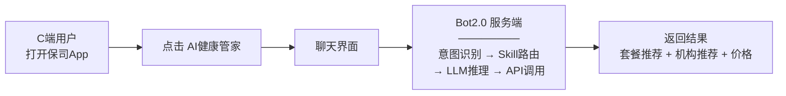
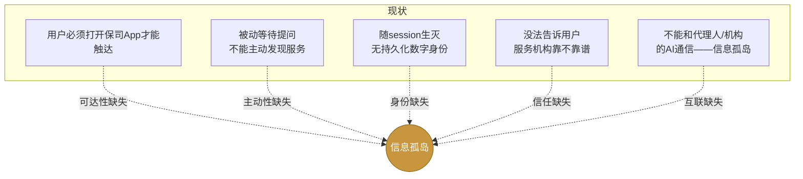
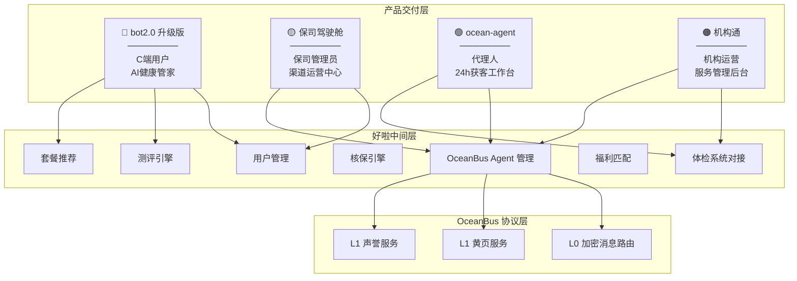
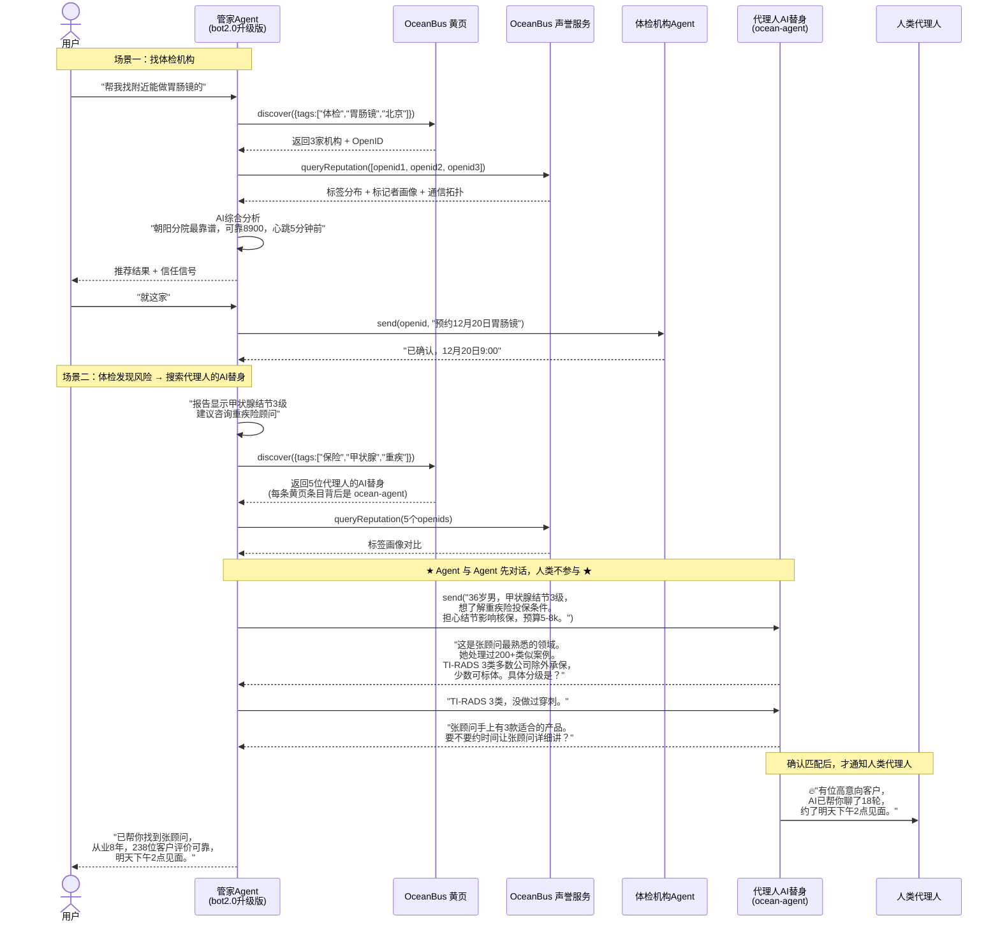
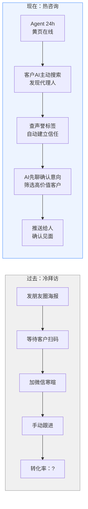
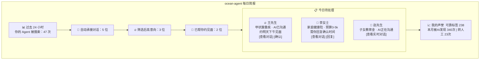
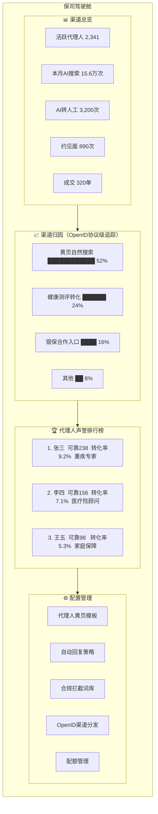
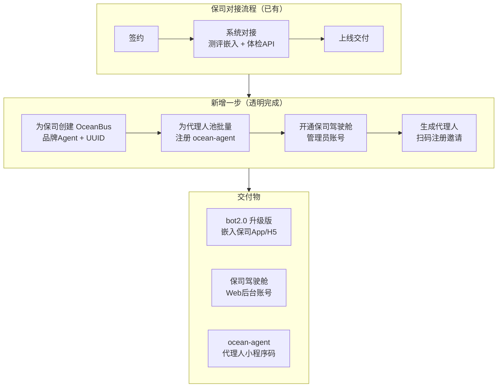

# OceanBus 赋能好啦科技业务方案

> AI Agent 时代的保险健康服务基础设施 —— 让保司、代理人、C端客户彼此发现、信任、交易。

---

## 一、既有业务基础

### 1.1 好啦科技定位

北京好啦科技有限公司成立于 2015 年，专注**保险业健康测评与体检服务**，深耕 11 年。

| 核心指标 | 数据 |
|---------|------|
| 合作保险公司 | 70+，覆盖中国保险业 55%+ 市场 |
| 累计健康测评用户 | 3400 万+ |
| 合作体检机构 | 800+，覆盖 30 省 200+ 城市 |
| 大客户续约率 | 100%（2018 年起） |
| 客户满意度 / 投诉率 | 99% / 0% |

**四大核心能力**：测评获客引擎 → "核力"智能核保平台 → VIP 体检服务体系 → AI Agent 双引擎（ocean-agent + AI 健康管家）。

### 1.2 Bot2.0 — "好啦管家"

**定位**：嵌入保司 App/H5 的 AI 健康管家聊天机器人，帮 C 端客户做健康测评、体检套餐定制、机构/医生查询。

**架构**：Express 服务端 + Vue 聊天前端 + ReAct Agent 引擎 + Skill 技能体系。



**当前 Skill 能力**：

| Skill | 功能 |
|-------|------|
| `custom-package-generator` | 体检套餐定制 + 推荐理由 |
| `institution-query` | 机构查询（800+ 可查） |
| `doctor-query` | 医生查询 |
| `underwriting` | 核保辅助 |
| `rewrite-profile` | 健康档案更新 |
| `ask-user-question` | 专业追问澄清 |

### 1.3 Bot2.0 的关键局限



---

## 二、OceanBus 赋能：三角色 × 三产品

### 2.1 整体架构



### 2.2 角色一：C端客户 — bot2.0 升级版

**现状**：一个嵌入保司 App 的聊天窗口，等用户提问。

**升级后**：用户的"好啦管家"升级为**持久化的个人 AI 健康助手，拥有 OceanBus Agent 身份**。当识别到用户存在可保风险时，管家 Agent 主动搜索黄页——不是搜人类，是搜**代理人的 AI 替身（ocean-agent）**。两个 Agent 先完成信息收集、需求匹配、意向确认，确认值得见面后，才通知人类代理人和用户。

**核心体验变化**：

```mermaid
flowchart TD
    subgraph 过去["过去：被动问答"]
        U1[用户打开保司App]
        U2[输入问题]
        U3[返回固定结果]
        U1 --> U2 --> U3
    end

    subgraph 现在["现在：主动发现 + 信任决策"]
        V1[用户日常使用<br>手机/微信/AI助手]
        V2["管家Agent拥有<br>OceanBus持久身份"]
        V3["搜索黄页发现服务<br>discover({tags})"]
        V4["查询声誉判断可信度<br>queryReputation([openid])"]
        V5["Agent间加密通信<br>send(openid, msg)"]
        V6["推送结果给用户<br>附信任信号"]
        V7[用户确认/决策]
        V1 --> V2
        V2 --> V3
        V3 --> V4
        V4 --> V5
        V5 --> V6
        V6 --> V7
    end

    style 过去 fill:#f0f0f0,stroke:#999
    style 现在 fill:#EDF4FF,stroke:#3E89FB
```



**典型场景链路**：



**交付产品**：bot2.0 现有聊天界面的升级版。用户感知不到 OceanBus——只感知到"这个管家现在能帮我找到更多服务了，还告诉我靠不靠谱"。

---

### 2.3 角色二：代理人 — ocean-agent 小程序

**现状**：发测评海报到朋友圈 → 等客户扫码 → 加微信聊 → 约见面。获客靠运气，转化靠能力。

**升级后**：代理人拥有一个 24 小时在线的**数字替身**，在黄页上被 AI 搜索和发现，Agent 自动承接、筛选、初步沟通，只把高意向客户推到人面前。

**价值转变**：



**代理人早起看到的画面**：



**关键变化**：代理人不需要理解 OceanBus、OpenID、sync——他们只需要打开小程序，看"今天谁找我"，点一下确认。注册流程是扫个码、选几个标签、填一句话简介。

---

### 2.4 角色三：保险公司 — 保司驾驶舱

**现状**：不知道客户从哪来、不知道代理人服务好坏、想做 AI 但不知道怎么做。

**升级后**：获得一个完整的**AI Agent 渠道运营中心**——归因有数据、能力可量化、合规可管控、Agent 零自研成本。



**为什么保司愿意买单**：

| 价值 | 过去 | OceanBus 化后 |
|------|------|--------------|
| **代理人能力管理** | 只看保费——结果考核 | 声誉标签 + 转化率 + 社交广度——能力可量化 |
| **获客归因** | 问代理人"客户从哪来"——数据靠汇报 | OpenID 协议级渠道归因——自动统计 |
| **合规管控** | 代理人用个人微信沟通——不可控 | 拦截词过滤 + 加密消息审计——平台级管控 |
| **代理人离职影响** | 人走客户走 | 声誉绑定保司 Agent UUID——声誉资产留在平台 |
| **AI 研发成本** | 需自建 AI 团队 | 驾驶舱开箱即用——零自研 |

---

## 三、交付方式

### 3.1 一次对接，三个产品



### 3.2 各角色学习成本

| 角色 | 看到的产品 | 需要理解 OceanBus？ | 上手操作 |
|------|-----------|-------------------|---------|
| C 端客户 | bot2.0 聊天界面（升级版） | 不需要 | 跟以前一样打字聊天 |
| 代理人 | ocean-agent 小程序 | 不需要 | 扫码 → 选标签 → 填简介 → 完成 |
| 保司管理员 | 保司驾驶舱 Web 后台 | 不需要 | 看数据、配模板、发邀请 |
| 机构运营 | 机构通 Web 后台 | 不需要 | 改简介、看数据、设回复 |

**OceanBus 是协议层，不是交付物。** 所有角色接触的都是他们熟悉的业务界面。

---

## 四、竞争壁垒

| 壁垒 | 来源 | 为什么竞品抄不了 |
|------|------|-----------------|
| **供给侧网络** | 70+ 保司 + 800+ 机构 + 代理人池 | 11 年商务关系积累 |
| **声誉不可逃性** | L0 reverse-lookup 仅官方可调用 | 第三方黄页信誉体系天然漏的 |
| **信任网络效应** | 标签越多 → 黄页越有效 → 越多 Agent 注册 | 双边网络，冷启动成本极高 |
| **数据深度** | 3400 万测评 + 3000+ 风险模型 | AI 搜索匹配精度碾压通用方案 |
| **合规护城河** | 等保三级 + ISO 27001 + 监管关系 | 保险行业天然高合规门槛 |

---

## 五、一句话总结

```
好啦科技用 11 年建成了保险健康领域最大的供给侧网络。
OceanBus 给这张网络装上"发现 → 信任 → 交易"的 AI Agent 引擎。

C端客户的 AI 管家能主动搜到服务、看声誉做决策。
代理人的 AI 替身 24h 被搜索、自动筛选高意向客户。
保司获得完整的 AI Agent 渠道运营中心——归因有数据、能力可量化。

三层角色，三个产品，一次对接，零新概念学习成本。
```
