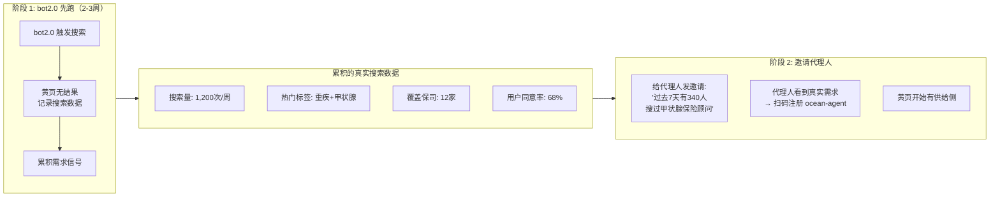

# bot2.0 OceanBus 升级方案

> 让用户的 AI 健康管家能搜到代理人的 AI 替身 —— bot2.0 最小改动，启动冷增长飞轮。

---

## 一、核心思路

bot2.0 已经是 70+ 保司的生产系统，3400 万+ 用户在里面做健康测评、定制体检、解读报告。**不需要重新获客，只需要在现有对话中加一个触发点。**

当 bot2.0 识别到用户存在**可保风险**时，主动提出搜索黄页——不是搜人类代理人，是搜**代理人的 AI 替身（ocean-agent）**。两个 Agent 先聊，聊好了才通知人类。

```
用户跟 bot2.0 聊天（跟以前一样）
  → bot2.0 识别可保风险
  → bot2.0 主动提议："要不要我帮你搜一下有没有合适的顾问？"
  → 用户同意
  → bot2.0 搜黄页 → 找到 ocean-agent（代理人的 AI 替身）
  → bot2.0 ↔ ocean-agent 两个 Agent 对话
  → 确认匹配后，bot2.0 告诉用户结果
  → ocean-agent 通知人类代理人
```

---

## 二、触发条件：什么时候提议搜索

不是每次对话都提——只在用户确实存在**可保风险且可能想了解保险**时触发。

### 2.1 触发规则

```mermaid
flowchart TD
    A[bot2.0 处理用户对话] --> B{识别到可保风险信号?}
    B -->|否| C[正常对话流程<br>不触发]
    B -->|是| D{用户是否已主动提保险?}
    D -->|是| E[直接触发搜索<br>用户明确需求]
    D -->|否| F{对话上下文是否适合?}
    F -->|正在办体检/投诉/紧急| C
    F -->|合适| G[主动提议搜索<br>"要不要我帮你找顾问？"]
    G --> H{用户同意?}
    H -->|是| E
    H -->|否| I["好的，以后需要随时找我"]
```

### 2.2 可保风险信号

| 信号类型 | 具体场景 | 示例 |
|---------|---------|------|
| **测评结果高风险** | 癌症/心脑血管/糖尿病测评得分偏高 | "你的甲状腺癌风险等级：中高风险" |
| **报告异常指标** | 体检报告解读中发现异常 | "甲状腺结节 TI-RADS 3 类，建议定期复查" |
| **用户主动提及保险** | 用户直接问 | "这个影响买保险吗？""重疾险能赔吗？" |
| **用户表达担忧** | 对健康状况表示焦虑 | "万一恶化了怎么办？""治疗要花多少钱？" |
| **家庭责任场景** | 上有老下有小 | "家里就我一个挣钱的""孩子还小""父母身体不好" |
| **年龄节点** | 30/40/50 岁 | "今年40了，感觉身体不如以前" |

### 2.3 不触发的场景

| 场景 | 为什么不触发 |
|------|------------|
| 用户正在操作体检预约 | 打断流程 —— 用户现在要的是约体检，不是买保险 |
| 用户正在投诉/抱怨 | 火上浇油 —— 先解决问题 |
| 用户已明确拒绝过（30天内） | 尊重边界 —— 不反复推销 |
| 对话刚开始（<3轮） | 还没建立信任 —— 先帮用户解决问题再提议 |
| 用户在咨询纯医学问题 | "感冒了吃什么药" —— 跟保险没关系 |

---

## 三、对话协议：bot2.0 ↔ ocean-agent

### 3.1 协议设计原则

两个 Agent 对话不是随便聊。需要一套**结构化协议**，保证信息完整、决策明确、可追溯。

```
协议分为三个阶段：

1. HANDOVER 移交阶段   bot2.0 → ocean-agent   传递用户画像和需求
2. MATCHING 匹配阶段   bot2.0 ↔ ocean-agent   双向确认是否匹配
3. RESOLUTION 决议阶段  ocean-agent → bot2.0   给出结论
```

### 3.2 消息格式

```json
// 阶段 1: HANDOVER — bot2.0 发起移交
{
  "phase": "HANDOVER",
  "user_profile": {
    "age": 36,
    "gender": "male",
    "risk_signals": ["甲状腺结节", "TI-RADS 3类"],
    "key_concern": "担心结节影响投保",
    "previous_denial": false
  },
  "context": {
    "trigger": "体检报告解读发现甲状腺结节3级",
    "budget_range": "年缴5000-8000",
    "urgency": "medium",
    "preferred_time": ["工作日下午", "周末上午"]
  }
}

// 阶段 2: MATCHING — ocean-agent 确认匹配
{
  "phase": "MATCHING",
  "status": "matched",
  "agent_capabilities": {
    "matching_tags": ["重疾", "甲状腺"],
    "relevant_cases": 200,
    "available_products": 3
  },
  "questions": [
    "TI-RADS具体分级是多少？",
    "是否做过穿刺活检？"
  ]
}

// 阶段 2: MATCHING — ocean-agent 确认不匹配
{
  "phase": "MATCHING",
  "status": "not_matched",
  "reason": "用户需要少儿保险顾问，我的主人专注成人重疾",
  "suggestion": "建议搜索 tags:['少儿保险','教育金']"
}

// 阶段 3: RESOLUTION — ocean-agent 给出结论
{
  "phase": "RESOLUTION",
  "conclusion": "meeting_scheduled",
  "meeting": {
    "time": "2026-05-07T14:00:00+08:00",
    "location": "XX人寿北京分公司",
    "agent_name": "张顾问",
    "prep_summary": "36岁男性，甲状腺结节3级未穿刺，预算5-8k，可选3款产品"
  }
}
```

### 3.3 完整对话示例

```
┌─ HANDOVER ─────────────────────────────────────────────┐
│ bot2.0 → ocean-agent:                                  │
│ "【移交】36岁男性，体检发现甲状腺结节TI-RADS 3类，      │
│  担心影响重疾险投保。预算年缴5000-8000。                │
│  客户未主动提保险，是AI在报告解读中发现异常后提议的。     │
│  请确认你的主人是否适合处理这个案例。"                    │
├─ MATCHING ─────────────────────────────────────────────┤
│ ocean-agent → bot2.0:                                  │
│ "【匹配确认】这是张顾问最熟悉的领域。她专注甲状腺重疾8年，│
│  处理过200+类似案例。TI-RADS 3类不等于拒保，多数公司    │
│  除外责任承保，少数可标体。需要确认：                    │
│  1. TI-RADS具体分级？                                   │
│  2. 是否做过穿刺？                                      │
│  3. 用户预算的上限灵活度？"                              │
│                                                        │
│ bot2.0 → ocean-agent:                                  │
│ "TI-RADS 3类，未穿刺。预算上限8k。                      │
│  用户说'不想白花钱，希望先了解哪些产品可能承保'。"        │
│                                                        │
│ ocean-agent → bot2.0:                                  │
│ "明白了。张顾问手上有3款产品适合3类结节，                │
│  其中A产品大概率标体承保。建议安排见面详细讲方案。        │
│  张顾问明天下午2点和后天上午10点可以。要不要约？"         │
│                                                        │
│ bot2.0 → ocean-agent:                                  │
│ "用户明天下午2点可以。约在？"                            │
│                                                        │
│ ocean-agent → bot2.0:                                  │
│ "XX人寿北京分公司，张顾问已确认。"                        │
├─ RESOLUTION ───────────────────────────────────────────┤
│ ocean-agent 通知人类代理人：                            │
│   🔥 "王先生，36岁，甲状腺结节3级，担心投保问题。        │
│       AI已帮你聊了18轮，确认是高意向客户，               │
│       约了明天下午2点在公司见面。                         │
│       对话摘要：结节3类未穿刺，预算5-8k，                │
│       筛选了3款产品，其中A产品可能标体。"                 │
│                                                        │
│ bot2.0 通知用户：                                      │
│   "已帮你找到张顾问，从业8年专注甲状腺重疾，             │
│    238位客户评价可靠。明天下午2点在XX人寿见面。           │
│    她会提前了解你的情况，不用重复说一遍。"                │
└────────────────────────────────────────────────────────┘
```

---

## 四、bot2.0 改动范围

### 4.1 不需要改的

- ✅ ReAct Agent 引擎 —— 不动
- ✅ Skill 体系 —— 不动
- ✅ 意图路由 —— 不动
- ✅ LLM Client —— 不动
- ✅ 前端聊天界面 —— 不动
- ✅ Session 管理 —— 不动
- ✅ 用户体系 —— 不动

### 4.2 需要改的

| 改动点 | 位置 | 改动量 | 说明 |
|--------|------|--------|------|
| **新增 Skill** | `skills/oceanbus-search/` | 新文件 | 黄页搜索 + 声誉查询 + Agent 通信 |
| **意图路由配置** | `config/intent_to_workflow.json` | +1 条目 | 注册新 Skill 到路由表 |
| **Workflow 触发逻辑** | `core/Workflow.js` | +~30行 | 在 process() 中增加可保风险检测 |
| **OceanBus 客户端** | 新增 `bridge/oceanbus-client.js` | 新文件 | 封装 OceanBus SDK 调用 |
| **前端提示** | `frontend/` | +~10行 | 搜索过程中的 loading 态 |

### 4.3 核心新增：oceanbus-search Skill

```
skills/oceanbus-search/
├── SKILL.md              # Skill 定义
├── scripts/
│   ├── main.js           # 入口：编排三阶段流程
│   ├── risk_detector.js  # 可保风险检测器
│   ├── yellow_search.js  # 黄页搜索 + 声誉查询
│   └── agent_dialogue.js # Agent-to-Agent 对话管理
```

**Skill 入参**：
```json
{
  "user_input": "用户原始输入",
  "user_profile": {
    "age": 36,
    "gender": "male",
    "health_signals": ["甲状腺结节", "TI-RADS 3类"]
  },
  "trigger": "report_interpretation",
  "session_id": "xxx"
}
```

**Skill 出参**：
```json
{
  "triggered": true,
  "risk_type": "thyroid_cancer",
  "search_tags": ["保险", "重疾", "甲状腺"],
  "search_results": [
    {
      "openid": "...",
      "tags": ["重疾", "甲状腺", "北京"],
      "description": "...",
      "reputation": { "可靠": 238, ... }
    }
  ],
  "dialogue_result": {
    "phase": "RESOLUTION",
    "conclusion": "meeting_scheduled",
    "meeting_time": "2026-05-07T14:00:00+08:00",
    "dialogue_rounds": 18
  }
}
```

### 4.4 Workflow 改动点

在 `core/Workflow.js` 的 `process()` 方法中，当 Intent Router 返回结果后，增加一个判断步骤：

```javascript
// core/Workflow.js — process() 中的新增逻辑

// 现有流程：意图识别 → Skill 执行 → 返回结果
// 新增：在 Skill 执行完成后，检查是否触发 oceanbus-search

async process(userInput, onProgress, sessionId, userContext) {
  // ... 现有逻辑 ...

  // ★ 新增：可保风险检测
  const riskSignal = await this.detectInsurableRisk(
    userInput, 
    sessionState.healthSignals,
    sessionState.contextSummary
  );

  if (riskSignal && !sessionState.userDeclinedSearch) {
    // 主动提议
    const proposal = await this.proposeSearch(sessionState, riskSignal);
    onProgress?.({ type: 'suggestion', content: proposal });
    // 等待用户下一轮确认
    sessionState.pendingRiskSearch = riskSignal;
  }

  // 如果用户上一轮同意了搜索
  if (sessionState.pendingRiskSearch && userInput.includes('好')) {
    // 执行 Agent 搜索 + 对话
    const result = await skillManager.execute('oceanbus-search', {
      user_input: userInput,
      user_profile: await this.buildUserProfile(userContext),
      health_signals: sessionState.healthSignals,
      trigger: sessionState.pendingRiskSearch.trigger
    });
    // ... 将结果渲染给用户 ...
  }

  // ... 现有逻辑 ...
}
```

**实际代码改动量**：Workflow.js 约 30 行新增。

---

## 五、没有搜到代理人时怎么办（阶段 1 的常态）

```
bot2.0 搜黄页 → discover 返回 0 条

bot2.0 对用户说：
"目前我的黄页上还没有擅长这个领域的顾问。
 我已经帮你记录了需求（甲状腺重疾 × 北京），
 等有合适的人选上线时，我会通知你。
 
 在这之前，你可以先了解重疾险的投保常识——"
 [展示知识卡片]

后台同时记录：
 {
   search_keywords: ["重疾", "甲状腺", "北京"],
   search_time: "2026-05-06T14:32:00+08:00",
   user_intent: "strong",
   trigger: "report_interpretation",
   company_id: "XX人寿"
 }

 → 这条数据是邀请代理人时最有说服力的素材
 → 也是保司驾驶舱中"未满足需求"指标的数据源
```

**用户感受**：bot2.0 变成了一个"有记忆的助手"——"她记住了我的需求，会帮我留意"。而不是"搜不到就没了"。

---

## 六、阶段 1 → 阶段 2 的数据流转



**邀请话术中用到的真实数据**：

- "过去 7 天，XX 人寿有 340 次搜索『重疾 + 甲状腺』"
- "68% 的用户在 AI 提议后同意搜索顾问"
- "目前这个领域黄页上还是空的——第一个上线的就是你"

---

## 七、上线顺序

```
第 1 周：bot2.0 升级开发
  ├── 新增 oceanbus-search Skill
  ├── 新增 oceanbus-client.js
  ├── Workflow 增加触发逻辑
  └── 前端增加 loading 态

第 2 周：内部验证
  ├── 选 1 家保司灰度上线
  ├── 观察：触发频率、搜索量、用户体验
  └── 调优：触发时机、提议话术

第 3 周：扩大灰度 + 开始累积搜索数据
  ├── 扩展到 5-10 家保司
  ├── 后台累积搜索数据
  └── 准备代理人邀请物料

第 4 周：开放 ocean-agent 邀请
  ├── 代理人收到邀请（带真实搜索数据）
  ├── 首批代理人扫码注册
  └── 黄页开始有供给侧

第 5-6 周：闭环验证
  ├── 用户搜索 → 有结果了
  ├── Agent 对话启动
  └── 第一次 Agent-to-Agent 到人类见面 → 标志闭环跑通
```

---

## 八、关键决策

| 决策 | 选择 | 原因 |
|------|------|------|
| 触发时机 | 在 Skill 执行完成后判断，不在意图路由阶段 | 不影响现有路由逻辑，改动最小 |
| 提议方式 | bot2.0 主动提议，用户确认后才搜索 | 避免用户感觉"被推销" |
| 黄页无结果时 | 记录 + 告知 + 不阻断 | 用户不因供给侧缺失而有挫败感 |
| Agent 对话 | 结构化三阶段协议 | 保证信息完整、可追溯、可审计 |
| 人类介入点 | Agent 确认匹配后才通知人类 | 人类只做最终决策，不参与信息收集 |
| OceanBus 调用 | 新增独立的 bridge/oceanbus-client.js | 隔离依赖，方便以后替换或 mock |
