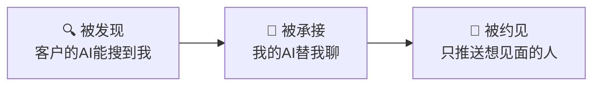
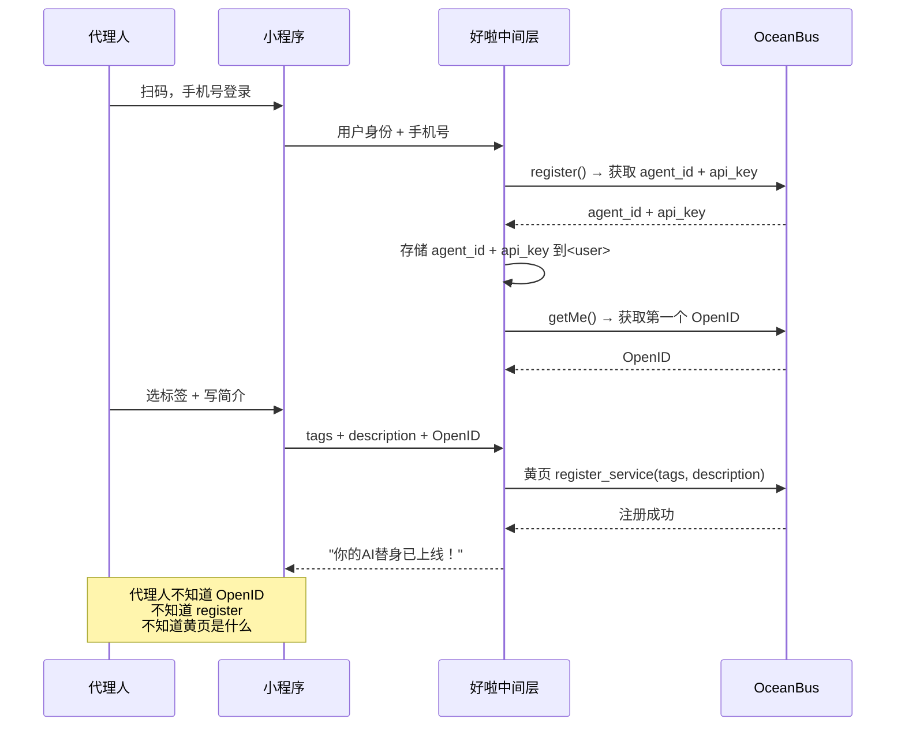

# ocean-agent MVP 产品设计

> 给保险代理人的 AI 替身小程序 —— 让客户的 AI 找到你，你的 AI 帮你聊，只把想见面的推到你面前。

---

## 一、先忘掉 OceanBus

**王姐的一天（现在）**：

```
7:00  翻开手机，转发公司统一做的测评海报到朋友圈和 8 个群
9:00  开始回昨晚的微信："王姐你好，我是看到你朋友圈的..." "哦不用不用我就随便看看"
11:00 翻通讯录，想："上次那个问重疾险的李先生，一个月没联系了，要不要再发一条？"
14:00 终于约到一个见面，跑去咖啡馆等了 40 分钟，对方说临时开会来不了
17:00 发了今天的第 3 条朋友圈，配文"懂保险的人，更懂生活"，16 个赞，0 个咨询
21:00 想想今天颗粒无收，又发了条"晚安，明天会更好"
```

王姐最大的痛点不是"我卖不出去保险"。是 **"我想找需要保险的人，但他们不知道我存在；知道我的，又不信任我；信任我的，又没有现在要买。"**

**王姐的理想一天（OceanBus 化后）**：

```
7:30  打开小程序看一眼：昨晚我的 AI 替身承接了 3 位客户的 AI 发来的咨询
      → 1 位高意向，AI 已经帮我约了今天下午见面
      → 2 位还在聊，AI 在了解需求阶段

9:00  到公司开早会，旁边的同事问"王姐你今天状态怎么这么轻松"
      "因为今天要见的人，是我 AI 替我聊好的。"

14:00 去见那位高意向客户。对方见面第一句话："你的 AI 说你对甲状腺相关重疾很专业，
      我看了你的评价，238 个客户都说你靠谱。我们直接聊方案吧。"
      —— 信任在见面之前就建立好了。

17:00 客户签单。打开小程序，给客户发一条："感谢信任！后续理赔有任何问题随时找我。"
      系统自动记录——又多了一个"可靠"标签的潜在来源。
```

**从王姐的视角，她要的不是"一个 AI 工具"。她要的是"一个帮我找到客户、帮我聊好客户的东西。我不需要知道它怎么做到的。"**

---

## 二、MVP 定义：就做三件事



| 功能 | 不在 MVP 里 | 原因 |
|------|-----------|------|
| 主动发测评海报 | ❌ | 代理人已经有这个习惯了，不抢这个场景 |
| 复杂数据分析 | ❌ | MVP 不需要仪表盘，需要的是"今天谁找我" |
| 团队管理 | ❌ | 先解决个体代理人，团队版是 v2 |
| 保单管理 | ❌ | 这是保司核心系统的活，不重复造 |
| 内容创作工具 | ❌ | 不抢朋友圈 |

**MVP 目标**：让代理人每天打开小程序一次，就知道"今天有没有人要见我"。

---

## 三、页面设计（4 个页面）

### 页面导航

```
┌──────────────────────────────────────┐
│  [首页]    [对话]    [我的]           │  ← 底部 3 个 tab
└──────────────────────────────────────┘
```

只有 4 个页面：首页、对话列表、对话详情、我的。总计可以做到。

---

### 页面一：首页（默认打开）

代理人打开小程序看到的第一眼。**只回答三个问题：今天谁找我？需要我做什么？我干得怎么样？**

```
┌──────────────────────────────────────┐
│  🌊 ocean-agent            [🔔] [···]│
│                                      │
│  早上好，王姐                          │
│                                      │
│  ┌────────────────────────────────┐  │
│  │  🔥 今天有 2 位新客户等你回复      │  │
│  │                                │  │
│  │  李先生 — 甲状腺重疾             │  │
│  │  "AI已沟通18轮，意向强，              │  │
│  │   客户想明天下午见面"               │  │
│  │  [查看对话]      [确认见面]       │  │
│  │                                │  │
│  │  张女士 — 家庭健康险              │  │
│  │  "AI已沟通7轮，客户还在比较，           │  │
│  │   需要你帮忙确认预算方案"           │  │
│  │  [查看对话]      [我去回复]       │  │
│  └────────────────────────────────┘  │
│                                      │
│  ┌────────────────────────────────┐  │
│  │  👀 AI 正在帮你聊的（1位）        │  │
│  │  周先生 · 子女教育金 · 第4轮对话中  │  │
│  └────────────────────────────────┘  │
│                                      │
│  ┌────────────────────────────────┐  │
│  │  📊 过去 7 天                    │  │
│  │  被搜索 187次 | 承接 12位 | 见面 4位│  │
│  └────────────────────────────────┘  │
│                                      │
│  ┌────────────────────────────────┐  │
│  │  🛡️ 我的声誉                    │  │
│  │  可靠标签 238 · 行业前 15%       │  │
│  │  "王姐，238个人说你靠谱"          │  │
│  └────────────────────────────────┘  │
│                                      │
│  [首页]    [对话]    [我的]           │
└──────────────────────────────────────┘
```

**设计原则**：
- 顶部问候语有人味儿——不是"数据看板"，是"你的助手在汇报"
- 第一张卡片就是"今天需要你处理的"——最重要的事放最前面
- 每个客户只有两行关键信息：谁、什么需求、AI 沟通到什么程度了
- 操作按钮是动词："查看对话"、"确认见面"、"我去回复"——代理人不需要思考该做什么
- 声誉卡片放底部，是长期激励，不是紧急事项
- "行业前 15%"给代理人社交货币——可以拿去跟客户说、跟同事比

---

### 页面二：对话列表

代理人想看"过去都有谁找过我"。

```
┌──────────────────────────────────────┐
│  ← 对话              筛选：[全部 ▼]   │
│                                      │
│  ┌────────────────────────────────┐  │
│  │ 🔥 李先生                        │  │
│  │ 甲状腺重疾 · 已沟通18轮            │  │
│  │ "好的，那我们明天下午见" — 2分钟前  │  │
│  │ 👤→🤖 需要你确认见面              │  │
│  └────────────────────────────────┘  │
│  ┌────────────────────────────────┐  │
│  │ 📝 张女士                        │  │
│  │ 家庭健康险 · 已沟通7轮             │  │
│  │ "我想再对比一下其他方案" — 1小时前  │  │
│  │ 🤖→🤖 AI 等待客户回复             │  │
│  └────────────────────────────────┘  │
│  ┌────────────────────────────────┐  │
│  │ ✅ 刘先生                        │  │
│  │ 养老规划 · 已见面                 │  │
│  │ "签完了，谢谢王姐" — 昨天         │  │
│  │ 👤→👤 已成交                    │  │
│  └────────────────────────────────┘  │
│  ┌────────────────────────────────┐  │
│  │ ❌ 陈女士                        │  │
│  │ 意外险 · 已停止                   │  │
│  │ "暂时不需要了" — 3天前            │  │
│  │ 👤→🤖 客户离开                  │  │
│  └────────────────────────────────┘  │
│                                      │
│  [首页]    [对话]    [我的]           │
└──────────────────────────────────────┘
```

**设计原则**：
- 按状态自然排序：待处理 → 进行中 → 已完成 → 已关闭
- 显示沟通状态图标：👤=面对人类客户 🤖=面对 AI → 👤→🤖 表示"需要代理人介入，现在是 AI 在聊"
- 最后一句话直接展示，代理人不用点进去就能想起上下文
- 筛选器 MVP 只做"全部 / 待我处理 / 已完成"三个选项

---

### 页面三：对话详情

代理人点击某个客户，看到 AI 跟客户聊了什么。

```
┌──────────────────────────────────────┐
│  ← 李先生 · 甲状腺重疾                  │
│                                      │
│  ┌────────────────────────────────┐  │
│  │  🤖 AI 摘要                     │  │
│  │                                │  │
│  │  客户画像：36岁男性，甲状腺结节3级   │  │
│  │  预算：年缴 5000-8000            │  │
│  │  核心需求：确诊后怕得癌，想覆盖     │  │
│  │  意向程度：⭐⭐⭐⭐⭐ 强           │  │
│  │  AI判断："客户已在决策阶段，        │  │
│  │    建议代理人尽快介入"            │  │
│  │                                │  │
│  │  客户可约时间：明天14:00 或 后天10:00│  │
│  └────────────────────────────────┘  │
│                                      │
│  ── AI与客户的对话 ──                  │
│                                      │
│  🤖 您好！我的主人王姐是专注甲状腺        │
│     相关重疾的保险顾问。我先了解一       │
│     下您的基本情况，方便后续她为您        │
│     精准推荐方案。                     │
│                          09:15       │
│                                      │
│  👤 你好。我今年36岁，上个月体检查       │
│     出甲状腺结节3级，医生说暂时不用      │
│     手术但要观察。我有点担心万一是恶     │
│     性的，想了解一下重疾险。           │
│                          09:18       │
│                                      │
│  🤖 理解您的担心。甲状腺结节3级在        │
│     重疾险中属于需要告知的事项，但不      │
│     等于拒保。王姐在这方面有 200 多       │
│     个成功案例。方便告诉我您的预算        │
│     范围吗？                         │
│                          09:20       │
│                                      │
│  ── 省略 15 轮对话 ──                  │
│                                      │
│  👤 好的，那我明天下午2点有空。         │
│                          11:32       │
│                                      │
│  ┌────────────────────────────────┐  │
│  │  ✍️ 现在需要你回复               │  │
│  │                                │  │
│  │  [输入你的回复...]               │  │
│  │                                │  │
│  │  💡 建议回复：                   │  │
│  │  "好的李先生，明天下午2点在我们    │  │
│  │   公司见，地址是..."              │  │
│  │  [一键使用]                     │  │
│  │                                │  │
│  │  [发送]                        │  │
│  └────────────────────────────────┘  │
└──────────────────────────────────────┘
```

**设计原则**：
- **先出摘要，再出对话**。代理人没时间看 18 轮完整对话。AI 摘要告诉她"这个人是谁、要什么、意向多强、你该做什么"，1 分钟读完
- 对话正文是可折叠的，代理人可以展开看具体某几轮
- 输入区有"建议回复"——不是替代理人决定，是帮她省打字时间。代理人可以一键使用，也可以自己改
- 关键信号用 emoji 和视觉强化：⭐⭐⭐⭐⭐ 比"意向率 95%"直观

---

### 页面四：我的

代理人管理自己的黄页形象和看声誉数据。

```
┌──────────────────────────────────────┐
│  我的                                │
│                                      │
│  ┌────────────────────────────────┐  │
│  │  🧑‍💼 王姐                        │  │
│  │  XX人寿 · 从业8年                │  │
│  │                                │  │
│  │  🛡️ 可靠标签 238               │  │
│  │  ████████░░ 超过 85% 的同行      │  │
│  │                                │  │
│  │  📅 1340天 持续积累              │  │
│  │  👥 47 位 不同客户打过标签        │  │
│  └────────────────────────────────┘  │
│                                      │
│  ┌────────────────────────────────┐  │
│  │  📝 我的黄页（客户AI看到的）       │
│  │                                │  │
│  │  标签：[重疾] [甲状腺] [北京]      │  │
│  │       [+ 修改]                  │  │
│  │                                │  │
│  │  简介：                          │  │
│  │  "从业8年，专注甲状腺/乳腺相关      │  │
│  │   重疾险。不推销，只帮有需要的       │  │
│  │   人找到合适的方案。200+真实案      │  │
│  │   例，欢迎先看我的历史评价。"       │  │
│  │       [修改]                    │  │
│  │                                │  │
│  │  💡 简介写得好，客户AI更愿选你     │  │
│  │  已帮你优化了 12 次               │  │
│  └────────────────────────────────┘  │
│                                      │
│  📊 数据详情                          │
│  本月被AI搜索 340次                   │
│  本月承接对话 23次                    │
│  本月成交 5单                        │
│                                      │
│  ⚙️ 设置                             │
│  自动承接时段：[08:00-22:00]          │
│  可约见面时间：[工作日 14:00-17:00]    │
│                                      │
│  [首页]    [对话]    [我的]           │
└──────────────────────────────────────┘
```

**设计原则**：
- 声誉卡片是核心——238 个可靠标签不是数字，是"超过 85% 的同行"，是社交货币
- 黄页卡片直接展示"客户 AI 看到我是什么样"——给代理人一个直观的感受：哦，原来我在 AI 眼里是这样的
- 简介是活的——系统会给优化建议（"加个案例数字会更好""试试写得更具体"），但最终控制权在代理人
- 设置部分 MVP 只做两个：自动承接时段（代理人可以设"晚上 10 点后别帮我接了"）、可约见面时间

---

## 四、极简上手流程

```
┌────────────┐    ┌────────────┐    ┌────────────┐    ┌────────────┐
│  扫码       │ →  │ 选 3-5 个标签 │ →  │ 写一句话简介  │ →  │  完成！     │
│  手机号登录  │    │ 我擅长什么    │    │ 让客户记住我  │    │  AI替身上线  │
└────────────┘    └────────────┘    └────────────┘    └────────────┘
    5秒              15秒              20秒              后台自动
```

**扫码后发生了什么（代理人无感）**：



代理人做的事情：选标签 + 写一句话。其余全部是后台自动完成。

**标签选择的设计**：

代理人不是在键盘上自由输入标签——是从一个预置列表中勾选。这个列表来自保司的业务线和好啦的标签体系：

```
请选择你的擅长领域（选 3-5 个）：

保险类别：                   健康相关：
□ 重疾险                     □ 甲状腺
□ 医疗险                     □ 乳腺
□ 意外险                     □ 三高/心血管
□ 寿险                       □ 糖尿病
□ 年金/养老                  □ 癌症筛查
□ 子女教育金                 □ 中医体质

客户类型：                   地区：
□ 个人                       □ 北京
□ 家庭                       □ 上海
□ 企业团体                   □ 广州
                              ...（自动定位）
```

这样设计的理由：标签是客户 AI 搜索时的精确匹配条件。自由输入会导致"重疾""重疾险""大病保险"三种写法，客户 AI 搜不到。预置列表保证一致性。

---

## 五、什么不做（MVP 的克制）

| 不做 | 为什么 |
|------|--------|
| 复杂数据看板 | 代理人只需要知道"今天谁找我"。月度报表在保司驾驶舱 |
| 主动发测评海报 | 代理人已经在微信里发了，不抢这个场景。MVP 聚焦"被找到" |
| 客户关系管理 | 保司已有 CRM，不重复 |
| 团队管理 | 先跑通个体代理人。团队版需要上级看下级数据，v2 |
| 内容推荐/话术库 | v2 可以做。MVP 先让"被发现"这件事跑起来 |
| 群发消息 | 反模式。OceanBus 是拉式获客，不是推式群发 |
| 手动搜索客户 | 代理人不应该能"搜客户"——这违反隐私。是客户的 AI 搜代理人，不是反过来 |
| 视频/直播集成 | 太多东西了。MVP 只做文字消息 |

**最重要的克制：不给代理人"主动找客户"的功能。** 这听起来反直觉，但这是 OceanBus 跟所有 CRM 的根本区别——代理人的价值不在于"搜到谁"，而在于"被谁的 AI 搜到"。

---

## 六、技术实现概要（给工程团队）

```
小程序端（微信小程序）
  ├── 登录：手机号授权
  ├── 标签选择：调好啦接口获取标签库 → 用户勾选
  ├── 首页数据：调好啦接口 → 返回今日线索列表
  ├── 对话列表：调好啦接口 → 返回对话列表
  ├── 对话详情：调好啦接口 → 返回对话历史 + AI 摘要
  ├── 发送消息：调好啦接口 → 好啦中间层通过 OceanBus send()
  └── 我的页面：调好啦接口 → 返回声誉数据 + 黄页信息

好啦中间层（新增接口）
  ├── POST /ocean-agent/register    → 透明注册 OceanBus Agent + 黄页
  ├── GET  /ocean-agent/home        → 返回今日线索、AI 摘要、统计数据
  ├── GET  /ocean-agent/conversations → 对话列表（含状态筛选）
  ├── GET  /ocean-agent/conversations/:id → 对话详情（含AI摘要）
  ├── POST /ocean-agent/conversations/:id/reply → 代理人发送消息
  ├── GET  /ocean-agent/profile     → 返回声誉数据 + 黄页信息
  └── PUT  /ocean-agent/profile     → 更新标签、简介、设置

OceanBus 层（复用）
  ├── register() + getMe()
  ├── 黄页 register_service / update_service
  ├── 声誉 queryReputation
  ├── L0 send / sync
  └── 绑定的 agent_id + api_key 存储在 好啦 的用户数据库
```

**关键**：小程序端不直接调 OceanBus。所有 OceanBus 操作由好啦中间层代理。理由：（1）key 管理安全——api_key 不暴露到小程序端；（2）业务逻辑聚合——首页数据需要组合 OceanBus 数据 + 好啦自有数据；（3）小程序端的网络请求数量和延迟可控。

---

## 七、MVP 成功标准

| 指标 | 目标 | 含义 |
|------|------|------|
| 注册完成率 | ≥ 80% | 扫码到"替身上线"的完成率 |
| 次日留存 | ≥ 50% | 第二天还会打开看 |
| 7 日活跃 | ≥ 30% | 持续使用的比例 |
| 代理人收到首条线索时间 | ≤ 72h | 上线后多久有客户 AI 搜索到他 |
| 代理人首次与客户对话 | ≤ 7 天 | 上线后多久完成首次人机协作 |
| NPS | ≥ 40 | "这小程序对我有用" |

**如果这些指标达到了**，说明 MVP 的核心假设成立：**代理人愿意被动获客，客户的 AI 确实在搜索，AI 先聊确实降低了代理人的获客成本。**

**如果没达到**，优先排查的不是功能少——是黄页上的供给侧是否足够、客户侧的 AI 助手使用量是否足够。问题不在小程序本身。

---

## 八、从王姐的视角再看一遍

```
王姐扫码 → 选标签 → 写简介 → 完成。

第二天早上打开：有 2 个新客户。

她点开第一个——AI 已经帮她聊好了，客户想明天下午见面。
她点"确认见面"，AI 自动发给客户确认。

她点开第二个——客户还在纠结方案，AI 在等。
她看眼 AI 摘要，写了两句话回复。

她放下手机，去开早会。

以前她的早晨是"发给谁，谁会回"。
现在是"谁找我，我去回"。
```

**这就是 MVP 要做的事。不是给代理人一个工具——是给她一个 AI 替身，让她从推式获客的循环里出来，进入拉式获客的时代。**
