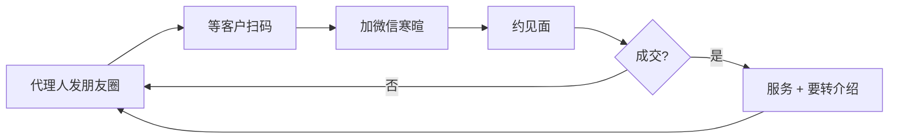
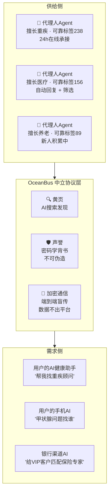
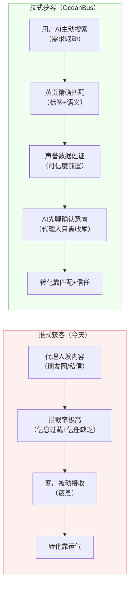
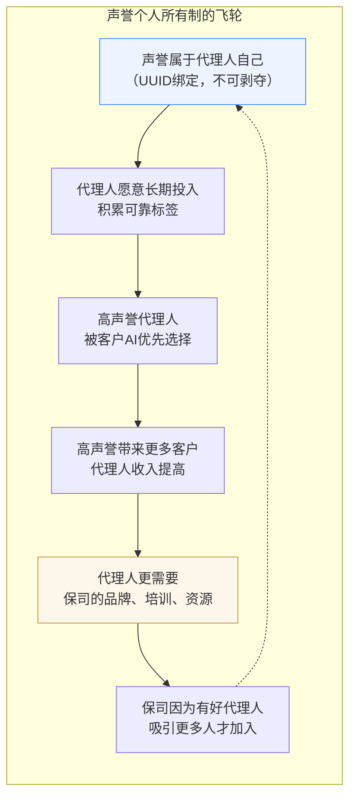
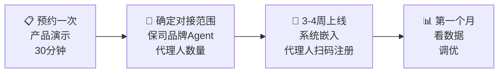

# 面向保险公司：为什么拥抱 OceanBus

> 一份给保险行业决策者的价值说明 —— AI 时代的获客方式变了，不是你要不要拥抱 Agent，是你的客户已经在用 Agent 找服务了。

---

## 一、正在发生的改变

两个事实：

**事实一**：2026 年，手机自带 AI 助手、微信 AI、智能音箱……用户的 AI 代理（AI Agent）正在成为他们获取信息和服务的第一入口。用户不再"搜百度 → 点链接 → 填表单"，而是对 AI 说："帮我找一位靠谱的重疾险顾问"。

**事实二**：AI 能搜索到的服务，才会被选择。AI 搜不到的，等于不存在。

**问题来了**：你们的代理人，能被用户的 AI 搜到吗？

---

## 二、今天的保险代理人获客：一个快失效的模型



这套模型的问题：

| 问题 | 数据表现 |
|------|---------|
| **触达效率低** | 朋友圈平均触达率 2-5%，测评海报打开率逐年下降 |
| **信任建立慢** | 代理人需要用 3-5 次见面才能让客户信任——全是时间成本 |
| **线索靠运气** | 代理人不知道谁"正在找保险"——只能广撒网，靠概率 |
| **流失不可控** | 代理人离职 = 客户关系归零。公司没有抓手 |
| **质量不可量** | 除了保费数字，你不知道这个代理人服务到底好不好 |

**本质问题**：代理人在做"推"的动作——把信息推向不确定的人群。而用户的 AI 在做"拉"的动作——拉取最匹配、最可信的服务方。推和拉之间，隔着一个时代。

---

## 三、OceanBus 是什么（业务语言版）

**一句话**：OceanBus 是 AI Agent 时代的"工商黄页 + 信誉系统"。它让保险代理人的 AI 替身 24 小时在线，被用户 AI 搜索、发现、验证、联系。



**三个核心能力**：

1. **黄页（服务发现）**：代理人注册后，用户的 AI 通过标签精确搜索到——"重疾 + 甲状腺 + 北京"直接匹配，不需要朋友圈海报
2. **声誉（信任基础设施）**：代理人的服务质量由真实客户的"可靠"标签量化。标签绑定在身份上，不可伪造、不可洗白。用户的 AI 一看就知道谁靠谱
3. **加密通信（安全合规）**：代理人和客户之间的消息端到端加密传输，平台看不到内容——满足保险行业最严苛的数据合规要求

**OceanBus 不是一套软件，是一个协议。** 就像 HTTP 是网页的协议，SMTP 是邮件的协议，OceanBus 是 AI Agent 之间"发现、信任、通信"的协议。

---

## 四、为什么这件事值得做

### 4.1 获客模式从"推"变"拉"



**推式获客**：代理人是信息发出者，用户是被动接收者。在信息过载的时代，拦截率只会越来越高。

**拉式获客**：用户的 AI 是搜索发起者，带着明确需求来找你。代理人从"求客户看一眼"变成"客户 AI 主动找到我、看了我的声誉、确认靠谱后联系我"。

这不是"又一个渠道"，这是获客方向的根本翻转。

### 4.2 信任不再靠嘴说

保险行业最大的成本是什么？不是佣金，不是培训，是**建立信任的时间**。

代理人跟陌生客户建立基本信任，需要多少次接触？多少次见面？多少次"朋友圈互动"？

OceanBus 把信任信号前置到了**搜索之前**：

| 客户 AI 看到的信息 | 含义 | 对比今天 |
|-------------------|------|---------|
| 可靠标签 238 个 | 238 个真实客户认可其服务 | 今天：代理人自己说"我很专业" |
| 标记者均龄 180 天 | 给他打标签的人不是新号，是真实老用户 | 今天：无法验证 |
| 社交广度 47 | 他跟 47 个不同的人有过业务往来 | 今天：你只知道他做了多少保费 |
| 标签积累 483 天 | 好评是长期持续积累的，不是一夜刷的 | 今天：无法验证 |
| 代理人的 AI 替身先跟你聊 | 你可以不暴露身份先了解 | 今天：第一次聊就必须暴露 |

**当一个代理人的可靠标签积累到 238，当标记者画像显示不是刷的——客户的 AI 不需要"信任"这个代理人，数学帮它做了判断。** 这在保险行业是前所未有的：信任从"人品担保"变成了"密码学担保"。

### 4.3 代理人更愿意留下——不是因为被锁住，而是因为值得留

说到这个，需要先坦诚一个设计事实：**在 OceanBus 体系中，Agent 的 UUID 和声誉属于代理人自己，不属于公司。** 代理人离职时，他的身份和所有标签跟他走——就像医生的执业资格证跟人不跟医院。

你可能会想：这对保司不是坏消息吗？

恰好相反。

**今天的问题不是"代理人能带走声誉"——今天的问题是"代理人根本没有声誉可以带走"。**

因为中心化体系里不存在密码学级别的个人声誉，代理人的积累都在保司的 CRM 系统里，离职时一个导出都拿不到。结果是：代理人没有动力投入声誉建设，因为建了也不是自己的。

**当声誉真正属于代理人自己时，三件事会改变：**



**声誉越属于个人，代理人越需要品牌。** 想象一个独立代理人，可靠标签 500，但背后没有任何保司品牌背书——客户 AI 会犹豫："这个人靠不靠谱？有没有公司管？"

而当这个代理人挂在"XX 人寿"品牌下时——客户 AI 看到的是**品牌 + 声誉的双重验证**，代理人获得更多客户，品牌获得更强的代理人粘性。

**声誉可携带，但携带的代价极高：**

| 场景 | 后果 |
|------|------|
| 代理人在职，声誉持续增长 | 收入增长，品牌受益——双赢 |
| 代理人离职，带走声誉 | 声誉跟人走，但新公司的品牌背书需要时间建立 |
| 代理人离职后自建品牌 | 需要 14 天 + 10 次会话才能在黄页注册，失去原公司资源支持 |
| 代理人频繁跳槽 | 每换一次，品牌关联断裂，客户 AI 会注意到"品牌频繁变更"——信任打折 |

**一个经营了 3 年、积累 500 个可靠标签的代理人，跳槽的代价不是零——是失去品牌背书、培训资源、团队支持。** 声誉的"可携带"恰好让代理人更清楚自己的价值所在，也让保司的管理从"卡住不让走"变成"让留下更有吸引力"。

**博弈论的结论**：当声誉归属个人但品牌归属公司，双方的最优策略不是互相防备——是合作。代理人建声誉，保司建品牌，客户得双重保障。

### 4.4 合规不是负担，是壁垒

保险是监管最严的行业之一。传统微信、个人手机沟通模式下：

- 代理人跟客户聊了什么？不知道
- 有没有承诺违规返佣？不知道
- 有没有误导销售？不知道

OceanBus 的加密通信 + 合规拦截器提供了：

| 合规能力 | 实现方式 |
|---------|---------|
| **内容不持有** | 消息端到端加密，平台不可读——满足《个人信息保护法》数据最小化原则 |
| **合规自动拦截** | 预设违规词（"返佣""保证收益"），Agent 自动拦截 |
| **声誉不可篡改** | 密码学绑定，保司自己也无法"美化"数据——审计可信 |
| **证据可追溯** | 违法标签附带完整消息上下文（±5 条），满足监管取证要求 |

**不持有、不篡改、不可读、可追溯**——这套方案比"给代理人发个工作微信"安全得多。当监管问"你们怎么管理代理人跟客户的沟通"，你有东西可以拿出来。

### 4.5 零研发成本，已有基建

你们不需要：

- ❌ 招聘 AI 团队
- ❌ 搭建服务器
- ❌ 研发 Agent 系统
- ❌ 对接 LLM 厂商
- ❌ 设计信誉体系
- ❌ 做安全合规

你们只需要：

- ✅ 现有的代理人扫码注册 ocean-agent
- ✅ 保司管理员开通驾驶舱账号
- ✅ 把 bot2.0（AI 健康管家）升级一个版本嵌入已有 App

**对接周期：跟你们已有的好啦科技合作流程一致——系统对接嵌入即可，3-4 周上线。**

---

## 五、你现在不做，会发生什么

一个思想实验：

> 假设 A 保司的代理人在 OceanBus 黄页上，24 小时被用户 AI 搜索；
> B 保司的代理人不在上面。
>
> 某天，用户对自己的 AI 助手说："帮我找一个擅长甲状腺相关的保险顾问。"
>
> AI 搜索黄页 → 返回 A 保司的 3 位代理人，带着声誉标签分布。
> B 保司的代理人根本不在结果里。
>
> **不是 B 保司的代理人不好——是 AI 根本不知道他们存在。**

在 AI 时代，"不被发现" = "不存在"。

这不是一个"要不要试试新渠道"的问题。这是**当用户的 AI 成为信息入口时，你的代理人还在不在货架上**的问题。

---

## 六、常见疑问

### Q: 消息经过中间节点，会不会很慢？

比中心化服务器直连慢。消息从发送到对方收取，有秒级延迟（取决于轮询间隔）。

**但保险不是即时通讯。** 客户咨询保险，期望的不是秒回，是被认真对待。代理人的 Agent 自动承接、AI 先聊——这个"慢"恰好保证了每条消息的可靠送达（72h 硬兜底，不丢消息）。

### Q: 我们的代理人能学会用吗？

代理人不需要理解 OceanBus。他们只需要：
1. 扫码
2. 选几个标签（擅长什么领域）
3. 写一句话简介

然后每天打开小程序，看"今天有谁找我"。AI 已经聊好了，他们点确认或回复即可。

### Q: 代理人离职把声誉带走了，我们岂不是亏了？

这是每个保司听到这里都会问的问题。直接回答：

**第一，声誉可携带 ≠ 跳槽无成本。** 一个代理人在黄页上的展示是"XX人寿 · 张三 · 可靠标签 500"。他离职后变成"独立 · 张三 · 可靠标签 500"——客户 AI 能感知到品牌背书的消失。如果客户搜索时倾向选择"有保司品牌背书的代理人"，他接单率会下降。品牌背书是保司的，不是代理人的——这一点没变。

**第二，没有声誉的年代，代理人就不跳槽了吗？** 代理人跳槽的核心原因是收入和发展，不是"声誉被锁住"。一个没有声誉体系的保司，代理人跳槽的理由恰恰是"在这里做得好不好没有区别"——因为你无法量化他的服务质量。

**第三，声誉可携带让这个行业对人才更有吸引力。** 当保险代理人知道自己的服务质量可以被密码学验证、可以跨公司携带时，优秀的人更愿意入行。保司争夺的不再是"谁能锁住人"，而是"谁能让优秀的人愿意来、愿意留"。

**第四，也是最重要的：声誉需要时间积累。** 一个可靠标签 500 的代理人，那 500 个标签是过去几年跟客户逐个交互积累的。即使他跳槽，新公司的客户也会看他的历史——包括他曾归属哪家保司。他的声誉史里写着你的品牌名字。这是永久的。

```
结论：声誉属于代理人 = 保司需要成为"值得代理人留下"的地方。
这与任何其他行业没有区别——优秀的医生选择医院，优秀的律师选择律所，
不是因为被锁住，而是因为那里能让他变得更好。
```

### Q: 声誉数据能造假吗？

技术上几乎不可能。三个机制保证：

1. **可靠标签绑定通信条件**：必须双向通信 ≥ 1 小时 + 消息 ≥ 5 条——脚本模拟不出 47 个真实社交关系
2. **标记者画像暴露刷标**：刷标的小号自身均龄短、社交圈窄、标签集中——算法一眼识别
3. **图自动修正**：刷标团伙自身暴露后，其所有衍生标签自动贬值——攻击成果清零

**声誉不是"谁标签多谁好"，是"标签背后的标记者自己有没有信誉"。这是一个递归验证体系——比简单的打分难攻破得多。**

### Q: 数据安全吗？客户隐私怎么保证？

- 消息 **XChaCha20-Poly1305 端到端加密**——OceanBus 平台看不到内容
- 用户的健康档案、体检报告仍然走好啦现有的安全链路——不经过 OceanBus
- OceanBus 只负责"发现代理人的 OpenID"和"发一条加密消息"——不传敏感数据
- 国家等保三级 + ISO 27001 认证，与好啦现有安全体系同一标准

### Q: 跟我们现有的 App、系统怎么配合？

OceanBus 是底层协议，接在你们已有的系统下面：

```
保司App（已有）                       代理人端
  ├── 测评（已有）                    ├── ocean-agent 小程序
  ├── AI健康管家（bot2.0升级）         │
  ├── 保单查询（已有）                 │
  └── ...                            └── ...
         │                                │
         └────────┬───────────────────────┘
                  │
              好啦中间层
           （用户管理 + 业务逻辑 + Agent管理）
                  │
            OceanBus L0 + L1
```

**C 端用户看不到 OceanBus，代理人看不到 OceanBus，管理员看不到 OceanBus。** 他们看到的是"AI 健康管家能搜到代理人了""代理人收到客户咨询了""驾驶舱有数据了"。

---

## 七、下一步



**这不是一个"考虑考虑"的选项。** 当用户的 AI 正在成为服务搜索的第一入口，让你的代理人出现在 AI 能搜到的货架上，不应该是明年的战略——是今年的标配。

---

> **联系好啦科技**：预约产品演示，详细了解 OceanBus 如何为你的代理人团队部署 AI 获客能力。
>
> 📍 北京市海淀区上地信息路 26 号中关村创业大厦 9 层
>
> 📞 186-0023-2331
>
> 🌐 微信公众号：好啦科技
